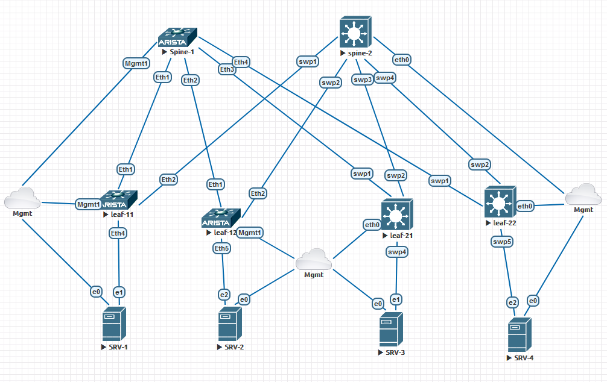

# Лабораторная работа L2VNI с маршрутизацией eBGP курса "Сетевой инженер ЦОД"
Цель: исследовать работу L2VNI на коммутаторах под управлением OS Cumulus и EOS Arista используя маршрутизацию iBGP

Лабы в рамках одного типа коммутаторов выполнены в отдельных папках. В рамках данной работы соберём следующую схему. Один из спйнов будет Arista, другой Cumulus, также на схеме есть две пары коммутаторов leaf разных вендоров.



## Первоначальная настройка

### Cumulus

Начнём конфигурацию с коммутаторов Cumulus 

1. Настройка Spine

Настройка интерфейсов Spine минималистична и заключается в простом прописывании интерфейсов

<details>

<summary>файл /etc/network/interfaces</summary>

```
# The loopback network interface
auto lo
iface lo inet loopback
    address 172.16.0.1/32

# The primary network interface
auto eth0
iface eth0 inet dhcp
    vrf mgmt

auto mgmt
iface mgmt
    address 127.0.0.1/8
    address ::1/128
    vrf-table auto

# The data network interface
auto swp1
iface swp1

auto swp2
iface swp2

auto swp3
iface swp3

auto swp4
iface swp4
```
</details>

Применяем настройки командой: sudo ifreload -a

<details>

<summary>Проверяем </summary>

```
cumulus@spine-2:mgmt:~$ ip a
1: lo: <LOOPBACK,UP,LOWER_UP> mtu 65536 qdisc noqueue state UNKNOWN group default qlen 1000
    link/loopback 00:00:00:00:00:00 brd 00:00:00:00:00:00
    inet 127.0.0.1/8 scope host lo
       valid_lft forever preferred_lft forever
    inet 172.16.0.1/32 scope global lo
       valid_lft forever preferred_lft forever
    inet6 ::1/128 scope host
       valid_lft forever preferred_lft forever
2: eth0: <BROADCAST,MULTICAST,UP,LOWER_UP> mtu 1500 qdisc pfifo_fast master mgmt state UP group default qlen 1000
    link/ether 50:01:00:02:00:00 brd ff:ff:ff:ff:ff:ff
    inet 172.31.255.12/24 brd 172.31.255.255 scope global dynamic eth0
       valid_lft 4795sec preferred_lft 4795sec
    inet6 fe80::5201:ff:fe02:0/64 scope link
       valid_lft forever preferred_lft forever
3: swp1: <BROADCAST,MULTICAST,UP,LOWER_UP> mtu 9216 qdisc pfifo_fast state UP group default qlen 1000
    link/ether 50:01:00:02:00:01 brd ff:ff:ff:ff:ff:ff
    inet6 fe80::5201:ff:fe02:1/64 scope link
       valid_lft forever preferred_lft forever
4: swp2: <BROADCAST,MULTICAST,UP,LOWER_UP> mtu 9216 qdisc pfifo_fast state UP group default qlen 1000
    link/ether 50:01:00:02:00:02 brd ff:ff:ff:ff:ff:ff
    inet6 fe80::5201:ff:fe02:2/64 scope link
       valid_lft forever preferred_lft forever
5: swp3: <BROADCAST,MULTICAST,UP,LOWER_UP> mtu 9216 qdisc pfifo_fast state UP group default qlen 1000
    link/ether 50:01:00:02:00:03 brd ff:ff:ff:ff:ff:ff
    inet6 fe80::5201:ff:fe02:3/64 scope link
       valid_lft forever preferred_lft forever
6: swp4: <BROADCAST,MULTICAST,UP,LOWER_UP> mtu 9216 qdisc pfifo_fast state UP group default qlen 1000
    link/ether 50:01:00:02:00:04 brd ff:ff:ff:ff:ff:ff
    inet6 fe80::5201:ff:fe02:4/64 scope link
       valid_lft forever preferred_lft forever
7: mgmt: <NOARP,MASTER,UP,LOWER_UP> mtu 65575 qdisc noqueue state UP group default qlen 1000
    link/ether 32:b0:fb:2c:2e:c0 brd ff:ff:ff:ff:ff:ff
    inet 127.0.0.1/8 scope host mgmt
       valid_lft forever preferred_lft forever
    inet6 ::1/128 scope host
       valid_lft forever preferred_lft forever
```

</details>

Интерфейсы присутствуют.
Остальная настройка будет проходить в утилите vtysh, где мы настроим ipv6 Neighbor Discovery(ND) на интерфейсах, пропишем ASN и в нём включим поддержку l2vni evpn.

<details>

<summary>В итоге, получим следующую конфигурацию</summary>

```
spine-2# sho run
Building configuration...

Current configuration:
!
frr version 8.4.3
frr defaults datacenter
hostname spine-2
log syslog informational
service integrated-vtysh-config
!
interface swp1
 ipv6 nd ra-interval 10
 no ipv6 nd suppress-ra
exit
!
interface swp2
 ipv6 nd ra-interval 10
 no ipv6 nd suppress-ra
exit
!
interface swp3
 ipv6 nd ra-interval 10
 no ipv6 nd suppress-ra
exit
!
interface swp4
 ipv6 nd ra-interval 10
 no ipv6 nd suppress-ra
exit
!
router bgp 65000
 bgp router-id 172.16.0.1
 neighbor underlay peer-group
 neighbor underlay remote-as external
 neighbor swp1 interface peer-group underlay
 neighbor swp2 interface peer-group underlay
 neighbor swp3 interface peer-group underlay
 neighbor swp4 interface peer-group underlay
 !
 address-family l2vpn evpn
  neighbor underlay activate
 exit-address-family
exit
!
end
```

</details>

2. Настройка leaf

Кроме простого прописывания интерфейсов, необходимо создать Vlan и vni. Также не забыть добавить в бридж интерфейсы участвующие в свичинге плюс интерфейсы vni.

<details>

<summary>В итоге, получим следующую конфигурацию на первом leaf</summary>

```
# The loopback network interface
auto lo
iface lo inet loopback
    address 172.16.1.3/32
    vxlan-local-tunnelip 172.16.1.3

# The primary network interface
auto eth0
iface eth0 inet dhcp
    vrf mgmt

auto mgmt
iface mgmt
    address 127.0.0.1/8
    address ::1/128
    vrf-table auto

#auto corporate
#iface corporate
#    vrf-table auto

auto swp1
iface swp1

auto swp2
iface swp2

auto swp3
iface swp3

auto swp4
iface swp4
    bridge-pvid 10

auto swp5
iface swp5
    bridge-pvid 10

auto vlan10
iface vlan10
    address 172.20.10.252/24
    vlan-id 10
    vlan-raw-device bridge
#    vrf corporate

auto vlan11
iface vlan11
    address 172.20.11.254/24
    vlan-id 11
    vlan-raw-device bridge
#    vrf corporate


auto bridge
iface bridge
    bridge-ports swp4 swp5 vni10010 vni10011
    bridge-vids 10 11
    bridge-vlan-aware yes

auto vni10010
iface vni10010
    bridge-access 10
    vxlan-id 10010
    mstpctl-bpduguard yes
    mstpctl-portbpdufilter yes

auto vni10011
iface vni10011
    bridge-access 11
    vxlan-id 10011
    mstpctl-bpduguard yes
    mstpctl-portbpdufilter yes
```

</details>

На интерфейсах Vlan прописаны временные ip адреса, для проверки связности с серверами, в конце мы их выключим.

<details>

<summary>После применения, проверяем что получилось</summary>

```
cumulus@leaf-21:mgmt:~$ ip a
1: lo: <LOOPBACK,UP,LOWER_UP> mtu 65536 qdisc noqueue state UNKNOWN group default qlen 1000
    link/loopback 00:00:00:00:00:00 brd 00:00:00:00:00:00
    inet 127.0.0.1/8 scope host lo
       valid_lft forever preferred_lft forever
    inet 172.16.1.3/32 scope global lo
       valid_lft forever preferred_lft forever
    inet6 ::1/128 scope host
       valid_lft forever preferred_lft forever
2: eth0: <BROADCAST,MULTICAST,UP,LOWER_UP> mtu 1500 qdisc pfifo_fast master mgmt state UP group default qlen 1000
    link/ether 50:01:00:04:00:00 brd ff:ff:ff:ff:ff:ff
    inet 172.31.255.14/24 brd 172.31.255.255 scope global dynamic eth0
       valid_lft 6022sec preferred_lft 6022sec
    inet6 fe80::5201:ff:fe04:0/64 scope link
       valid_lft forever preferred_lft forever
3: swp1: <BROADCAST,MULTICAST,UP,LOWER_UP> mtu 9216 qdisc pfifo_fast state UP group default qlen 1000
    link/ether 50:01:00:04:00:01 brd ff:ff:ff:ff:ff:ff
    inet6 fe80::5201:ff:fe04:1/64 scope link
       valid_lft forever preferred_lft forever
4: swp2: <BROADCAST,MULTICAST,UP,LOWER_UP> mtu 9216 qdisc pfifo_fast state UP group default qlen 1000
    link/ether 50:01:00:04:00:02 brd ff:ff:ff:ff:ff:ff
    inet6 fe80::5201:ff:fe04:2/64 scope link
       valid_lft forever preferred_lft forever
5: swp3: <BROADCAST,MULTICAST,UP,LOWER_UP> mtu 9216 qdisc pfifo_fast state UP group default qlen 1000
    link/ether 50:01:00:04:00:03 brd ff:ff:ff:ff:ff:ff
    inet6 fe80::5201:ff:fe04:3/64 scope link
       valid_lft forever preferred_lft forever
6: swp4: <BROADCAST,MULTICAST,UP,LOWER_UP> mtu 9216 qdisc pfifo_fast master bridge state UP group default qlen 1000
    link/ether 50:01:00:04:00:04 brd ff:ff:ff:ff:ff:ff
7: swp5: <BROADCAST,MULTICAST,UP,LOWER_UP> mtu 9216 qdisc pfifo_fast master bridge state UP group default qlen 1000
    link/ether 50:01:00:04:00:05 brd ff:ff:ff:ff:ff:ff
8: mgmt: <NOARP,MASTER,UP,LOWER_UP> mtu 65575 qdisc noqueue state UP group default qlen 1000
    link/ether 66:17:bd:7a:44:dd brd ff:ff:ff:ff:ff:ff
    inet 127.0.0.1/8 scope host mgmt
       valid_lft forever preferred_lft forever
    inet6 ::1/128 scope host
       valid_lft forever preferred_lft forever
11: bridge: <BROADCAST,MULTICAST,UP,LOWER_UP> mtu 9216 qdisc noqueue state UP group default qlen 1000
    link/ether 50:01:00:04:00:04 brd ff:ff:ff:ff:ff:ff
    inet6 fe80::5201:ff:fe04:4/64 scope link
       valid_lft forever preferred_lft forever
12: vlan10@bridge: <BROADCAST,MULTICAST,UP,LOWER_UP> mtu 9216 qdisc noqueue state UP group default qlen 1000
    link/ether 50:01:00:04:00:04 brd ff:ff:ff:ff:ff:ff
    inet 172.20.10.252/24 scope global vlan10
       valid_lft forever preferred_lft forever
    inet6 fe80::5201:ff:fe04:4/64 scope link
       valid_lft forever preferred_lft forever
13: vlan11@bridge: <BROADCAST,MULTICAST,UP,LOWER_UP> mtu 9216 qdisc noqueue state UP group default qlen 1000
    link/ether 50:01:00:04:00:04 brd ff:ff:ff:ff:ff:ff
    inet 172.20.11.254/24 scope global vlan11
       valid_lft forever preferred_lft forever
    inet6 fe80::5201:ff:fe04:4/64 scope link
       valid_lft forever preferred_lft forever
14: vni10011: <BROADCAST,MULTICAST,UP,LOWER_UP> mtu 9216 qdisc noqueue master bridge state UNKNOWN group default qlen 1000
    link/ether 96:44:d0:05:47:35 brd ff:ff:ff:ff:ff:ff
15: vni10010: <BROADCAST,MULTICAST,UP,LOWER_UP> mtu 9216 qdisc noqueue master bridge state UNKNOWN group default qlen 1000
    link/ether ea:d4:47:38:70:c0 brd ff:ff:ff:ff:ff:ff
```

</details>

Интервейсы созданы, и сконфигурированы, добавлены в брижд (об этом говорит наличие "master bridge") созданы Vlan.
При настройке маршрутизации, в первую очередь нужно обеспечить анонсы интерфейсов loobbak0 (lo), для этого создадим соответствующий Route-map который применим в секции "address-family ipv4 unicast", а также в настройках EVPN добавим "волшебную" опцию "advertise-all-vni"

<details>

<summary>В итоге, получим следующую конфигурацию на первом leaf</summary>

```
leaf-21# sho run
Building configuration...

Current configuration:
!
frr version 8.4.3
frr defaults datacenter
hostname leaf-11
log syslog informational
hostname leaf-21
service integrated-vtysh-config
!
interface swp1
 ipv6 nd ra-interval 10
 no ipv6 nd suppress-ra
exit
!
interface swp2
 ipv6 nd ra-interval 10
 no ipv6 nd suppress-ra
exit
!
router bgp 65003
 bgp router-id 172.16.1.3
 neighbor underlay peer-group
 neighbor underlay remote-as external
 neighbor swp1 interface peer-group underlay
 neighbor swp2 interface peer-group underlay
 !
 address-family ipv4 unicast
  redistribute connected route-map ADVERTS
 exit-address-family
 !
 address-family l2vpn evpn
  neighbor underlay activate
  advertise-all-vni
 exit-address-family
exit
!
route-map ADVERTS permit 10
 match interface lo
exit
!
end
```

</details>

<details>

<summary>Проверяем установление соседства</summary>

```
leaf-21# sho ip bgp summ

IPv4 Unicast Summary (VRF default):
BGP router identifier 172.16.1.3, local AS number 65003 vrf-id 0
BGP table version 51
RIB entries 3, using 576 bytes of memory
Peers 2, using 40 KiB of memory
Peer groups 1, using 64 bytes of memory

Neighbor        V         AS   MsgRcvd   MsgSent   TblVer  InQ OutQ  Up/Down State/PfxRcd   PfxSnt Desc
swp1            4      65000      5595      4821        0    0    0 00:02:28         Idle        0 N/A
spine-2(swp2)   4      65000      6231      6237        0    0    0 00:00:11            1        2 N/A

Total number of neighbors 2
```

</details>

Соседство установлено только с одним Spine, что логично.

3. Настройка серверов

Настройка заключается в прописывании адресов на интерфесах серверов. Первоначально все интерфейсы находятся в одном Vlan 10

<details>

<summary>Поэтому получим результат</summary>

```
eve@ubuntu22-server:~$ ping 172.20.10.252
PING 172.20.10.252 (172.20.10.252) 56(84) bytes of data.
64 bytes from 172.20.10.252: icmp_seq=1 ttl=64 time=2.94 ms
64 bytes from 172.20.10.252: icmp_seq=2 ttl=64 time=0.319 ms
^C
--- 172.20.10.252 ping statistics ---
2 packets transmitted, 2 received, 0% packet loss, time 1002ms
rtt min/avg/max/mdev = 0.319/1.627/2.936/1.308 ms
eve@ubuntu22-server:~$ ping 172.20.10.253
PING 172.20.10.253 (172.20.10.253) 56(84) bytes of data.
64 bytes from 172.20.10.253: icmp_seq=1 ttl=64 time=2.98 ms
64 bytes from 172.20.10.253: icmp_seq=2 ttl=64 time=1.14 ms
^C
--- 172.20.10.253 ping statistics ---
2 packets transmitted, 2 received, 0% packet loss, time 1001ms
rtt min/avg/max/mdev = 1.137/2.058/2.980/0.921 ms
eve@ubuntu22-server:~$ ping 172.20.10.4
PING 172.20.10.4 (172.20.10.4) 56(84) bytes of data.
64 bytes from 172.20.10.4: icmp_seq=1 ttl=64 time=1.30 ms
64 bytes from 172.20.10.4: icmp_seq=2 ttl=64 time=1.67 ms
^C
--- 172.20.10.4 ping statistics ---
3 packets transmitted, 2 received, 33.3333% packet loss, time 2004ms
rtt min/avg/max/mdev = 1.295/1.481/1.667/0.186 ms
```

</details>

Первоначальная настройка Cumulus закончина. Приступаем к настройке Arista

### Arista

1. Настройка Spine

Настройка Spine аналогична лабе по eBGP.

<details>

<summary>В итоге, получим следующую конфигурацию</summary>

```
hostname spine-1
!
spanning-tree mode mstp
!
vrf instance mgmt
!
interface Ethernet1
   no switchport
   ipv6 enable
!
interface Ethernet2
   no switchport
   ipv6 enable
!
interface Ethernet3
   shutdown
   no switchport
   ipv6 enable
!
interface Ethernet4
   shutdown
   no switchport
   ipv6 enable
!
interface Management1
   vrf mgmt
   ip address dhcp
!
ip routing ipv6 interfaces
no ip routing vrf mgmt
!
ipv6 unicast-routing
!
ip route vrf mgmt 0.0.0.0/0 172.31.255.254
!
router bgp 65000
   router-id 172.16.0.1
   neighbor underlay peer group
   neighbor underlay send-community extended
   neighbor interface Et1 peer-group underlay remote-as 65001
   neighbor interface Et2 peer-group underlay remote-as 65002
   neighbor interface Et3 peer-group underlay remote-as 65003
   neighbor interface Et4 peer-group underlay remote-as 65004
   !
   address-family evpn
      neighbor underlay activate
   !
   address-family ipv4
      neighbor underlay activate
      neighbor underlay next-hop address-family ipv6 originate
!
end
```

</details>

<details>

<summary>Проверяем на leaf(Cumulus) установление соседства</summary>

```
leaf-21# sho ip  bgp summ

IPv4 Unicast Summary (VRF default):
BGP router identifier 172.16.1.3, local AS number 65003 vrf-id 0
BGP table version 52
RIB entries 3, using 576 bytes of memory
Peers 2, using 40 KiB of memory
Peer groups 1, using 64 bytes of memory

Neighbor        V         AS   MsgRcvd   MsgSent   TblVer  InQ OutQ  Up/Down State/PfxRcd   PfxSnt Desc
swp1            4      65000      5621      4848        0    0    0 00:00:45            1        2 N/A
spine-2(swp2)   4      65000      6633      6639        0    0    0 00:20:16            1        2 N/A

```

</details>

Соседство установлено

2. Настройка Leaf

a. Поднимим ipv6 на интерфейсах что идут в Spine, удалим их из свичинга.

b. Создадим vlan и на их интерфейсах пропишем временные ip адреса.

c. Создадим интерфейс vxlan, пропишем в нём интерфейс с котрого будут ходить VPN, и свяжем, пока vlan10 и VNI метку.

d. Пропишем маршрутизацию, как в лабе по eBGP.

e. Создадим vlan 10 в который необходимо прописать Route Distinguisher (RD) и Route Target (RT), которые подсмотрим у Cumulus.

<details>

<summary>Так маршруты выглядят на leaf(Cumulus)</summary>

```
leaf-21# show bgp l2vpn evpn
BGP table version is 11, local router ID is 172.16.1.3
Status codes: s suppressed, d damped, h history, * valid, > best, i - internal
Origin codes: i - IGP, e - EGP, ? - incomplete
EVPN type-1 prefix: [1]:[EthTag]:[ESI]:[IPlen]:[VTEP-IP]:[Frag-id]
EVPN type-2 prefix: [2]:[EthTag]:[MAClen]:[MAC]:[IPlen]:[IP]
EVPN type-3 prefix: [3]:[EthTag]:[IPlen]:[OrigIP]
EVPN type-4 prefix: [4]:[ESI]:[IPlen]:[OrigIP]
EVPN type-5 prefix: [5]:[EthTag]:[IPlen]:[IP]

   Network          Next Hop            Metric LocPrf Weight Path
Route Distinguisher: 172.16.1.3:2
*> [3]:[0]:[32]:[172.16.1.3]
                    172.16.1.3 (leaf-11)
                                                       32768 i
                    ET:8 RT:65003:10011
Route Distinguisher: 172.16.1.3:3
*> [2]:[0]:[48]:[00:50:01:00:09:01]
                    172.16.1.3 (leaf-11)
                                                       32768 i
                    ET:8 RT:65003:10010
*> [2]:[0]:[48]:[00:50:01:00:09:01]:[32]:[172.20.10.3]
                    172.16.1.3 (leaf-11)
                                                       32768 i
                    ET:8 RT:65003:10010
*> [2]:[0]:[48]:[00:50:01:00:09:01]:[128]:[fe80::250:1ff:fe00:901]
                    172.16.1.3 (leaf-11)
                                                       32768 i
                    ET:8 RT:65003:10010
*> [3]:[0]:[32]:[172.16.1.3]
                    172.16.1.3 (leaf-11)
                                                       32768 i
                    ET:8 RT:65003:10010
Route Distinguisher: 172.16.1.4:2
*  [2]:[0]:[48]:[00:50:01:00:0a:02]
                    172.16.1.4                             0 65000 65004 i
                    RT:65004:10010 ET:8
*>                  172.16.1.4 (spine-2)
                                                           0 65000 65004 i
                    RT:65004:10010 ET:8
*  [2]:[0]:[48]:[00:50:01:00:0a:02]:[32]:[172.20.10.4]
                    172.16.1.4                             0 65000 65004 i
                    RT:65004:10010 ET:8
*>                  172.16.1.4 (spine-2)
                                                           0 65000 65004 i
                    RT:65004:10010 ET:8
*  [2]:[0]:[48]:[00:50:01:00:0a:02]:[128]:[fe80::250:1ff:fe00:a02]
                    172.16.1.4                             0 65000 65004 i
                    RT:65004:10010 ET:8
*>                  172.16.1.4 (spine-2)
                                                           0 65000 65004 i
                    RT:65004:10010 ET:8
*  [3]:[0]:[32]:[172.16.1.4]
                    172.16.1.4                             0 65000 65004 i
                    RT:65004:10010 ET:8
*>                  172.16.1.4 (spine-2)
                                                           0 65000 65004 i
                    RT:65004:10010 ET:8
Route Distinguisher: 172.16.1.4:3
*  [3]:[0]:[32]:[172.16.1.4]
                    172.16.1.4                             0 65000 65004 i
                    RT:65004:10011 ET:8
*>                  172.16.1.4 (spine-2)
                                                           0 65000 65004 i
                    RT:65004:10011 ET:8

Displayed 10 out of 15 total prefixes
```

</details>

Как видим, для vlan10 RD это адрес интерфейса источника и номер по порядку, в данном случае - "2", а RD это ASN и индекс VNI. Значит, нам нужно произвести соответствующие преобразования.

<details>

<summary>В итоге, получим следующую конфигурацию</summary>

```
service routing protocols model multi-agent
!
hostname leaf-11
!
spanning-tree mode mstp
!
vlan 10-11
!
vrf instance mgmt
!
interface Ethernet1
   no switchport
   ipv6 enable
!
interface Ethernet2
   no switchport
   ipv6 enable
!
interface Ethernet3
!
interface Ethernet4
   switchport access vlan 10
!
interface Ethernet5
   switchport access vlan 10
!
interface Loopback1
   ip address 172.16.1.1/32
!
interface Loopback2
   ip address 172.17.1.1/32
!
interface Management1
   vrf mgmt
   ip address dhcp
!
interface Vlan10
!
interface Vlan11
   ip address 172.20.11.254/24
!
interface Vxlan1
   vxlan source-interface Loopback1
   vxlan udp-port 4789
   vxlan vlan 10 vni 10010
!
ip routing ipv6 interfaces
no ip routing vrf mgmt
!
ipv6 unicast-routing
!
ip route vrf mgmt 0.0.0.0/0 172.31.255.254
!
route-map ADVERT_INT permit 10
   match interface Loopback1
!
router bgp 65001
   router-id 172.16.1.1
   neighbor underlay peer group
   neighbor underlay send-community extended
   redistribute connected route-map ADVERT_INT
   neighbor interface Et1-2 peer-group underlay remote-as 65000
   !
   vlan 10
      rd 172.16.1.1:2
      route-target import 65002:10010
      route-target import 65003:10010
      route-target import 65004:10010
      route-target export 65001:10010
      redistribute learned
   !
   vlan 11
      rd 172.16.1.1:3
      route-target import 65002:10011
      route-target import 65003:10011
      route-target import 65004:10011
      route-target export 65001:10011
   !
   address-family evpn
      neighbor underlay activate
   !
   address-family ipv4
      neighbor underlay activate
      neighbor underlay next-hop address-family ipv6 originate
!
end
```

</details>


<details>

<summary>Проверим установление соседства</summary>

```
leaf-11#sho bgp summary
BGP summary information for VRF default
Router identifier 172.16.1.1, local AS number 65001
Neighbor                             AS Session State AFI/SAFI                AFI/SAFI State   NLRI Rcd   NLRI Acc
--------------------------- ----------- ------------- ----------------------- -------------- ---------- ----------
fe80::5201:ff:fe02:1%Et2          65000 Established   IPv4 Unicast            Negotiated              3          3
fe80::5201:ff:fe02:1%Et2          65000 Established   L2VPN EVPN              Negotiated             12         12
fe80::5201:ff:fee5:e36a%Et1       65000 Established   IPv4 Unicast            Negotiated              3          3
fe80::5201:ff:fee5:e36a%Et1       65000 Established   L2VPN EVPN              Negotiated             12         12

```

</details>

Соседство установлено

<details>

<summary>Посмотрим таблицу маршрутизаци evpn</summary>

```
leaf-11#sho bgp evpn
BGP routing table information for VRF default
Router identifier 172.16.1.1, local AS number 65001
Route status codes: * - valid, > - active, S - Stale, E - ECMP head, e - ECMP
                    c - Contributing to ECMP, % - Pending BGP convergence
Origin codes: i - IGP, e - EGP, ? - incomplete
AS Path Attributes: Or-ID - Originator ID, C-LST - Cluster List, LL Nexthop - Link Local Nexthop

          Network                Next Hop              Metric  LocPref Weight  Path
 * >      RD: 172.16.1.1:2 mac-ip 0050.0100.0701
                                 -                     -       -       0       i
 * >Ec    RD: 172.16.1.2:2 mac-ip 0050.0100.0802
                                 172.16.1.2            -       100     0       65000 65002 i
 *  ec    RD: 172.16.1.2:2 mac-ip 0050.0100.0802
                                 172.16.1.2            -       100     0       65000 65002 i
 * >Ec    RD: 172.16.1.3:3 mac-ip 0050.0100.0901
                                 172.16.1.3            -       100     0       65000 65003 i
 *  ec    RD: 172.16.1.3:3 mac-ip 0050.0100.0901
                                 172.16.1.3            -       100     0       65000 65003 i
 * >Ec    RD: 172.16.1.3:3 mac-ip 0050.0100.0901 172.20.10.3
                                 172.16.1.3            -       100     0       65000 65003 i
 *  ec    RD: 172.16.1.3:3 mac-ip 0050.0100.0901 172.20.10.3
                                 172.16.1.3            -       100     0       65000 65003 i
 * >Ec    RD: 172.16.1.3:3 mac-ip 0050.0100.0901 fe80::250:1ff:fe00:901
                                 172.16.1.3            -       100     0       65000 65003 i
 *  ec    RD: 172.16.1.3:3 mac-ip 0050.0100.0901 fe80::250:1ff:fe00:901
                                 172.16.1.3            -       100     0       65000 65003 i
 * >Ec    RD: 172.16.1.4:2 mac-ip 0050.0100.0a02
                                 172.16.1.4            -       100     0       65000 65004 i
 *  ec    RD: 172.16.1.4:2 mac-ip 0050.0100.0a02
                                 172.16.1.4            -       100     0       65000 65004 i
 * >Ec    RD: 172.16.1.4:2 mac-ip 0050.0100.0a02 172.20.10.4
                                 172.16.1.4            -       100     0       65000 65004 i
 *  ec    RD: 172.16.1.4:2 mac-ip 0050.0100.0a02 172.20.10.4
                                 172.16.1.4            -       100     0       65000 65004 i
 * >Ec    RD: 172.16.1.4:2 mac-ip 0050.0100.0a02 fe80::250:1ff:fe00:a02
                                 172.16.1.4            -       100     0       65000 65004 i
 *  ec    RD: 172.16.1.4:2 mac-ip 0050.0100.0a02 fe80::250:1ff:fe00:a02
                                 172.16.1.4            -       100     0       65000 65004 i
 * >      RD: 172.16.1.1:2 imet 172.16.1.1
                                 -                     -       -       0       i
 * >Ec    RD: 172.16.1.2:2 imet 172.16.1.2
                                 172.16.1.2            -       100     0       65000 65002 i
 *  ec    RD: 172.16.1.2:2 imet 172.16.1.2
                                 172.16.1.2            -       100     0       65000 65002 i
 * >Ec    RD: 172.16.1.3:2 imet 172.16.1.3
                                 172.16.1.3            -       100     0       65000 65003 i
 *  ec    RD: 172.16.1.3:2 imet 172.16.1.3
                                 172.16.1.3            -       100     0       65000 65003 i
 * >Ec    RD: 172.16.1.3:3 imet 172.16.1.3
                                 172.16.1.3            -       100     0       65000 65003 i
 *  ec    RD: 172.16.1.3:3 imet 172.16.1.3
                                 172.16.1.3            -       100     0       65000 65003 i
 * >Ec    RD: 172.16.1.4:2 imet 172.16.1.4
                                 172.16.1.4            -       100     0       65000 65004 i
 *  ec    RD: 172.16.1.4:2 imet 172.16.1.4
                                 172.16.1.4            -       100     0       65000 65004 i
 * >Ec    RD: 172.16.1.4:3 imet 172.16.1.4
                                 172.16.1.4            -       100     0       65000 65004 i
 *  ec    RD: 172.16.1.4:3 imet 172.16.1.4
                                 172.16.1.4            -       100     0       65000 65004 i
```

</details>

3. Настройка серверов

Пропишем аддреса на интерфейсы, и попробуем посмотреть прохождение трафика

<details>

<summary>Получим</summary>

```
eve@ubuntu22-server:~$ ping 172.20.10.2 -c 3
PING 172.20.10.2 (172.20.10.2) 56(84) bytes of data.
64 bytes from 172.20.10.2: icmp_seq=1 ttl=64 time=106 ms
64 bytes from 172.20.10.2: icmp_seq=2 ttl=64 time=14.8 ms
64 bytes from 172.20.10.2: icmp_seq=3 ttl=64 time=12.8 ms

--- 172.20.10.2 ping statistics ---
3 packets transmitted, 3 received, 0% packet loss, time 2004ms
rtt min/avg/max/mdev = 12.754/44.425/105.687/43.326 ms
eve@ubuntu22-server:~$ ping 172.20.10.3 -c 3
PING 172.20.10.3 (172.20.10.3) 56(84) bytes of data.
64 bytes from 172.20.10.3: icmp_seq=1 ttl=64 time=7.34 ms
64 bytes from 172.20.10.3: icmp_seq=2 ttl=64 time=6.96 ms
64 bytes from 172.20.10.3: icmp_seq=3 ttl=64 time=7.74 ms

--- 172.20.10.3 ping statistics ---
3 packets transmitted, 3 received, 0% packet loss, time 2003ms
rtt min/avg/max/mdev = 6.955/7.344/7.735/0.318 ms
eve@ubuntu22-server:~$ ping 172.20.10.4 -c 3
PING 172.20.10.4 (172.20.10.4) 56(84) bytes of data.
64 bytes from 172.20.10.4: icmp_seq=1 ttl=64 time=17.5 ms
64 bytes from 172.20.10.4: icmp_seq=2 ttl=64 time=25.7 ms
64 bytes from 172.20.10.4: icmp_seq=3 ttl=64 time=9.64 ms

--- 172.20.10.4 ping statistics ---
3 packets transmitted, 3 received, 0% packet loss, time 2004ms
rtt min/avg/max/mdev = 9.643/17.597/25.666/6.541 ms
```

</details>

Трафик ходит.

# Окончательная настройка

На Leaf(Arista) разнесём сервера по Vlan, допишем в интерфейсе vxlan 1 недостающий vlan и мапинг с do sho run
На Leaf(Cumulus), также, разнесём сервера по Vlan.
На всех leaf удалим адреса на интерфейсах Vlan.
У нас получилось, что в разных vlan одинаковые сети, проверим работу от первого сервера. Он в одной Vlan с третьим сервером. Ничего доругого пинговаться с него не должно

 <details>

<summary>Получим</summary>

```
eve@srv-1:~$ ping -c 3 172.20.10.252
PING 172.20.10.252 (172.20.10.252) 56(84) bytes of data.
From 172.20.10.1 icmp_seq=1 Destination Host Unreachable
From 172.20.10.1 icmp_seq=2 Destination Host Unreachable
From 172.20.10.1 icmp_seq=3 Destination Host Unreachable

--- 172.20.10.252 ping statistics ---
3 packets transmitted, 0 received, +3 errors, 100% packet loss, time 2033ms
pipe 3
eve@srv-1:~$ ping -c 3 172.20.10.253
PING 172.20.10.253 (172.20.10.253) 56(84) bytes of data.

--- 172.20.10.253 ping statistics ---
3 packets transmitted, 0 received, 100% packet loss, time 2034ms

eve@srv-1:~$ ping -c 3 172.20.10.254
PING 172.20.10.254 (172.20.10.254) 56(84) bytes of data.
From 172.20.10.1 icmp_seq=1 Destination Host Unreachable
From 172.20.10.1 icmp_seq=2 Destination Host Unreachable
From 172.20.10.1 icmp_seq=3 Destination Host Unreachable

--- 172.20.10.254 ping statistics ---
3 packets transmitted, 0 received, +3 errors, 100% packet loss, time 2030ms
pipe 3
eve@srv-1:~$ ping -c 3 172.20.10.2
PING 172.20.10.2 (172.20.10.2) 56(84) bytes of data.
From 172.20.10.1 icmp_seq=1 Destination Host Unreachable
From 172.20.10.1 icmp_seq=2 Destination Host Unreachable
From 172.20.10.1 icmp_seq=3 Destination Host Unreachable

--- 172.20.10.2 ping statistics ---
3 packets transmitted, 0 received, +3 errors, 100% packet loss, time 2042ms
pipe 3
eve@srv-1:~$ ping -c 3 172.20.10.3
PING 172.20.10.3 (172.20.10.3) 56(84) bytes of data.
64 bytes from 172.20.10.3: icmp_seq=1 ttl=64 time=19.8 ms
64 bytes from 172.20.10.3: icmp_seq=2 ttl=64 time=8.20 ms
64 bytes from 172.20.10.3: icmp_seq=3 ttl=64 time=6.35 ms

--- 172.20.10.3 ping statistics ---
3 packets transmitted, 3 received, 0% packet loss, time 2003ms
rtt min/avg/max/mdev = 6.351/11.455/19.817/5.960 ms
eve@srv-1:~$ ping -c 3 172.20.10.4
PING 172.20.10.4 (172.20.10.4) 56(84) bytes of data.
From 172.20.10.1 icmp_seq=1 Destination Host Unreachable
From 172.20.10.1 icmp_seq=2 Destination Host Unreachable
From 172.20.10.1 icmp_seq=3 Destination Host Unreachable

--- 172.20.10.4 ping statistics ---
3 packets transmitted, 0 received, +3 errors, 100% packet loss, time 2044ms
pipe 3
```

</details>

Нужный трафик ходит, а не нужный - нет.

Вывод: настройка Cumulus больше подходит для автоматизации, так как для Arista нужно перечислять всех соседей, что неудобно. Плюс, если на горячую подключать новые коммутаторы, придётся изменять настроки BGP.


