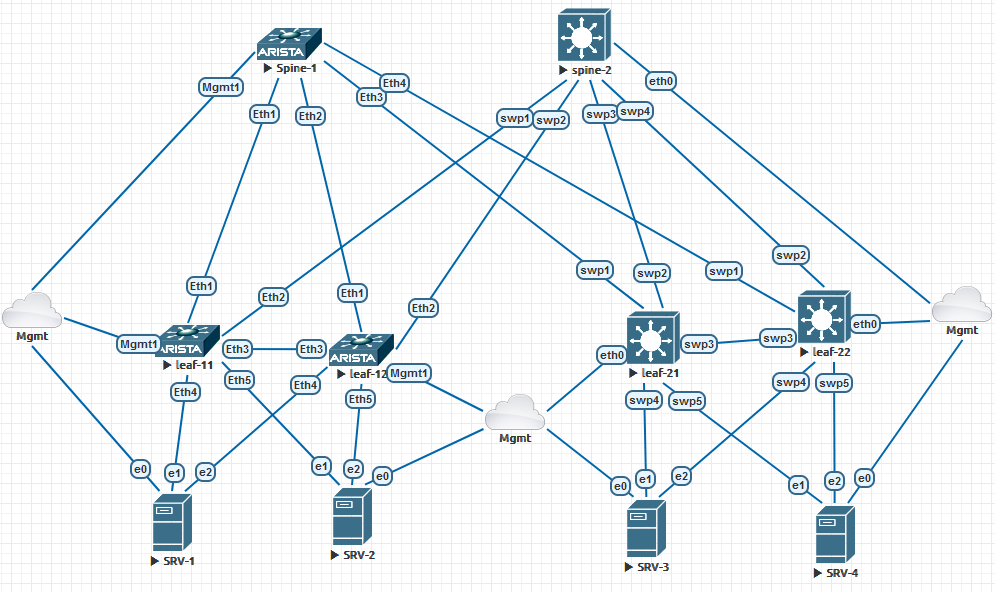

# Лабораторная работа курса Инженер связи дата-центра
Цель: исследовать работу коммутаторов Arista и Cumulus соединённых в пары MLAG с отработкой технологий L3VPN, Distributed Gateway, с маршрутизацией eBGP.
За основу возьмём предыдущую лабу, но немного изменим топологию соединив коммутаторы leaf перемычкой. Данная перемычка будет служить peerlink интерфейсом в технологии MLAG.



## MLAG
Оба производителя определяют применяемую на коммутаторах технологию как MLAG. Но настраиваются по разному

### Arista  MLAG
Настройку начнём с создания специального vlan 4094. Данный vlan нигде больше нельзя использовать, только для создания peerlink интерфейса.
Добавим его в группу "peerlink" (на самом деле, можно назвать её как угодно)

```
vlan 4094
   trunk group peerlink
```

Затем, в эту же группу добавим интерфейс Port-channel, через который будет проходить взаимодействие между коммутаторами.

```
interface Port-Channel3
   switchport mode trunk
   switchport trunk group peerlink
!
interface Ethernet3
   channel-group 3 mode active
!
```
Пропишем адрес на vlan4094, для проверки работоспособности линка, и выключим на нём STP

```
no spanning-tree vlan-id 4094
!
interface Vlan4094
   no autostate
   ip address 10.0.0.1/30
!
```

Затем создаём настройку, собственно, MLAG, где укажем его параметры, какие порты будут участвовать в этом, какой адрес будет использоваться для проверки работы партнёра, а также домен, который будет одинаковым на всей фабрике.

```
mlag configuration
   domain-id mlag1
   local-interface Vlan4094
   peer-address 10.0.0.2
   peer-link Port-Channel3
```
На этом настройка, непосредственно MLAG закончена, проверим его работу.

```
leaf-11#sho mlag
MLAG Configuration:
domain-id                          :               mlag1
local-interface                    :            Vlan4094
peer-address                       :            10.0.0.2
peer-link                          :       Port-Channel3
peer-config                        :          consistent

MLAG Status:
state                              :              Active
negotiation status                 :           Connected
peer-link status                   :                  Up
local-int status                   :                  Up
system-id                          :   52:01:00:80:dd:21
dual-primary detection             :            Disabled
dual-primary interface errdisabled :               False

MLAG Ports:
Disabled                           :                   0
Configured                         :                   0
Inactive                           :                   0
Active-partial                     :                   0
Active-full                        :                   0
```
Пропишем MLAG id на интерфейсах:

```
interface Port-Channel4
   switchport access vlan 10
   mlag 4
!
interface Port-Channel5
   switchport access vlan 11
   mlag 5
!
interface Ethernet4
   channel-group 4 mode active
!
interface Ethernet5
   channel-group 5 mode active
```
На серверах настройку LACP будем производить через NETPLAN, для чего пропишем в его конфигурационный файл (```/etc/netplan/00-installer-config.yaml ```) следующие настройки:
```
network:
  version: 2
  renderer: networkd
  ethernets:
    ens3:
      dhcp4: yes
      dhcp6: no
    ens4:
      dhcp4: no
      dhcp6: no
    ens5:
      dhcp4: no
      dhcp6: no
  bonds:
    bond0:
      macaddress: 00:50:00:ff:10:01
      interfaces:
        - ens4
        - ens5
      dhcp4: no
      dhcp6: no
      addresses:
        - 172.20.10.1/24
      routes:
        - via: 172.20.10.254
          to: 0.0.0.0/0
      parameters:
        mode: 802.3ad
        lacp-rate: fast
        mii-monitor-interval: 100
        transmit-hash-policy: layer3+4

```
Непосредственно за создание LACP интерфейса отвечает секция "bonds".
Проверим на коммутаторе состояние интерфейсов 
```
leaf-11#sho mlag interfaces
                                                                 local/remote
   mlag       desc             state       local       remote          status
---------- ---------- ----------------- ----------- ------------ ------------
      4                  active-full         Po4          Po4           up/up
      5                  active-full         Po5          Po5           up/up
```
Интерфейсы собрались и работают.
Проверим доступность шлюза с серверов, он настраивался в прошлой лабораторной.
```
eve@srv1:~$ ping 172.20.10.254 -c 4
PING 172.20.10.254 (172.20.10.254) 56(84) bytes of data.
64 bytes from 172.20.10.254: icmp_seq=1 ttl=64 time=19.1 ms
64 bytes from 172.20.10.254: icmp_seq=2 ttl=64 time=6.06 ms
64 bytes from 172.20.10.254: icmp_seq=3 ttl=64 time=6.47 ms
64 bytes from 172.20.10.254: icmp_seq=4 ttl=64 time=34.2 ms

--- 172.20.10.254 ping statistics ---
4 packets transmitted, 4 received, 0% packet loss, time 3004ms
rtt min/avg/max/mdev = 6.055/16.467/34.210/11.513 ms
```
Настройка завершена

### Cumulus    MLAG

процесс который отвечает за технологию MLAG на коммутаторах Cumulus называется Clag. Поэтому некоторые параметры будут иметь эту аббревиатуру.

Настройка MLAG, впрочем, как и любых других интерфейсов производится в файле ```/etc/network/interfaces```
```
# MLAG Peerlink bond

auto peerlink
iface peerlink
    bond-slaves swp3

# MLAG

auto peerlink.4094
iface peerlink.4094
    clagd-peer-ip linklocal
    clagd-backup-ip 172.31.255.15 vrf mgmt
    clagd-sys-mac 44:38:39:ff:ff:11
    clagd-priority 1000
    clagd-args --redirectEnable
    clagd-args --initDelay 300
```
Далее добавим Clag-id на интерфейсы, и добавим интерфейс peerlink в бридж

```
# Bonds

auto bond4
iface bond4
    bond-slaves swp4
    hwaddress 44:38:39:ff:ff:11
    bridge-access 11
    clag-id 4

auto bond5
iface bond5
    bond-slaves swp5
    bridge-pvid 14
    bridge-vids 11
    clag-id 5

# Bridge

auto bridge
iface bridge
    bridge-ports peerlink vxlan1000 vni10011 bond4 bond5
    bridge-vids 11 14
    bridge-vlan-aware yes

```
Применим конфигурацию командой "sudo ifreload -a" , а после проверим как собрались интерфейсы 
```
cumulus@leaf-21:mgmt:~$ net sho clag
The peer is alive
     Our Priority, ID, and Role: 1000 50:01:00:04:00:03 primary
    Peer Priority, ID, and Role: 2000 50:01:00:05:00:03 secondary
          Peer Interface and IP: peerlink.4094 fe80::5201:ff:fe05:3 (linklocal)
               VxLAN Anycast IP: 172.17.1.2
                      Backup IP: 172.31.255.15 vrf mgmt (active)
                     System MAC: 44:38:39:ff:ff:11

CLAG Interfaces
Our Interface      Peer Interface     CLAG Id   Conflicts              Proto-Down Reason
----------------   ----------------   -------   --------------------   -----------------
           bond4   bond4              4         duplicate lacp         -
                                                partner mac
           bond5   bond5              5         duplicate lacp         -
                                                partner mac
        vni10011   vni10011           -         -                      -
       vxlan1000   vxlan1000          -         -                      -
```
CLAG - выдаёт конфликт, но после многих часов траблшуттинга, убрать его мне так и не удалось.  
Сам Cumulus генерирует массу MAC, возможно, они и создают проблемы.
```
cumulus@leaf-21:mgmt:~$ net sho bridge mac

VLAN      Master  Interface  MAC                TunnelDest  State      Flags               LastSeen
--------  ------  ---------  -----------------  ----------  ---------  ------------------  ---------------
1         bridge  bridge     50:01:00:04:00:03              permanent                      1 day, 00:18:13
11        bridge  bond4      00:50:00:ff:11:03                                             00:00:18
11        bridge  bridge     44:38:39:00:01:00              permanent                      01:03:01
11        bridge  bridge     50:01:00:04:00:03              permanent                      01:03:01
11        bridge  peerlink   50:01:00:05:00:03              static     sticky              1 day, 00:17:55
14        bridge  bond5      00:50:00:ff:14:04                                             00:00:38
14        bridge  bridge     44:38:39:00:01:00              permanent                      01:03:01
14        bridge  bridge     50:01:00:04:00:03              permanent                      01:03:01
14        bridge  peerlink   50:01:00:05:00:03              static     sticky              1 day, 00:17:55
1000      bridge  bridge     44:38:39:00:01:00              permanent                      01:03:01
1000      bridge  bridge     50:01:00:04:00:03              permanent                      01:03:01
1000      bridge  vxlan1000  50:01:00:05:00:03                         extern_learn        02:11:22
1000      bridge  vxlan1000  50:01:00:80:dd:21                         extern_learn        02:57:36
1000      bridge  vxlan1000  50:01:00:ca:7a:8d                         extern_learn        02:04:12
untagged          bridge     44:38:39:00:01:00              permanent  self                <1 sec
untagged          vlan11     44:38:39:00:01:00              permanent  self                <1 sec
untagged          vlan14     44:38:39:00:01:00              permanent  self                <1 sec
untagged          vlan1000   44:38:39:00:01:00              permanent  self                <1 sec
untagged          vni10011   00:00:00:00:00:00  172.17.1.1  permanent  self                02:13:59
untagged          vxlan1000  50:01:00:05:00:03  172.16.1.4             self, extern_learn  02:11:22
untagged          vxlan1000  50:01:00:80:dd:21  172.17.1.1             self, extern_learn  02:57:11
untagged          vxlan1000  50:01:00:ca:7a:8d  172.17.1.1             self, extern_learn  02:04:12
untagged  bridge  bond4      44:38:39:ff:ff:11              permanent                      01:14:21
untagged  bridge  peerlink   50:01:00:04:00:03              permanent                      1 day, 00:18:13
untagged  bridge  vni10011   92:43:c4:a5:60:68              permanent                      1 day, 00:18:13
untagged  bridge  vxlan1000  ae:d8:d5:c5:82:ed              permanent                      1 day, 00:18:13
```
Настройки на серверах идентичны и на Arista, проблем не вызывали, поэтому склоняюсь к ошибке образа. Образ с более ранней версией таких проблем не вызывал.
Тем не менее, несмотря на конфликт, LACP работает.

```
eve@srv3:~$ ping 172.20.11.254 -c 3
PING 172.20.11.254 (172.20.11.254) 56(84) bytes of data.
64 bytes from 172.20.11.254: icmp_seq=1 ttl=64 time=1.84 ms
64 bytes from 172.20.11.254: icmp_seq=2 ttl=64 time=0.793 ms
64 bytes from 172.20.11.254: icmp_seq=3 ttl=64 time=0.589 ms

--- 172.20.11.254 ping statistics ---
3 packets transmitted, 3 received, 0% packet loss, time 2003ms
rtt min/avg/max/mdev = 0.589/1.075/1.844/0.549 ms
eve@srv3:~$ sudo ip link set ens4 down
[sudo] password for eve:
eve@srv3:~$ ping 172.20.11.254 -c 3
PING 172.20.11.254 (172.20.11.254) 56(84) bytes of data.
64 bytes from 172.20.11.254: icmp_seq=1 ttl=64 time=1.11 ms
64 bytes from 172.20.11.254: icmp_seq=2 ttl=64 time=0.747 ms
64 bytes from 172.20.11.254: icmp_seq=3 ttl=64 time=1.21 ms

--- 172.20.11.254 ping statistics ---
3 packets transmitted, 3 received, 0% packet loss, time 2021ms
rtt min/avg/max/mdev = 0.747/1.021/1.207/0.198 ms
eve@srv3:~$ sudo ip link set ens4 up
eve@srv3:~$ sudo ip link set ens5 down
eve@srv3:~$ ping 172.20.11.254 -c 3
PING 172.20.11.254 (172.20.11.254) 56(84) bytes of data.
64 bytes from 172.20.11.254: icmp_seq=1 ttl=64 time=0.965 ms
64 bytes from 172.20.11.254: icmp_seq=2 ttl=64 time=0.680 ms
64 bytes from 172.20.11.254: icmp_seq=3 ttl=64 time=0.592 ms

--- 172.20.11.254 ping statistics ---
3 packets transmitted, 3 received, 0% packet loss, time 2027ms
rtt min/avg/max/mdev = 0.592/0.745/0.965/0.159 ms
eve@srv3:~$ sudo ip link set ens5 up
```
На этом настройка MLAG закончена.

### Коррекция eBGP и проверка работы Distributed Gateway, а также L2 и L3 VPN

Так как теперь, оба коммутатора должны работать как один, то нужно прописать одинаковый ip для интерфейса от которого создаются VPN каналы. На Arista, просто прописываем на интерфейсе Loopback 1 одинаковые ip адреса.

```
interface Loopback1
   ip address 172.17.1.1/32
```
А на Cumulus, на интерфейс loopback прописываем дополнительный параметр "clagd-vxlan-anycast-ip" 
```
auto lo
iface lo inet loopback
    address 172.16.1.3/32
    vxlan-local-tunnelip 172.16.1.3
    clagd-vxlan-anycast-ip 172.17.1.2
```
После этого. всё начинает работать, но, согласно пожеланиям, мы должны прописать единые RD RT на всей фабрике.

Поэтому на Arista конфигурация eBGP будет следующей
```
route-map ADVERT_INT permit 10
   match interface Loopback1
!
router bgp 65001
   router-id 172.16.1.1
   neighbor underlay peer group
   neighbor underlay send-community extended
   redistribute connected route-map ADVERT_INT
   neighbor interface Et1-2 peer-group underlay remote-as 65000
   !
   vlan 11
      rd 172.16.1.1:11
      route-target import 10011:10011
      route-target export 10011:10011
   !
   address-family evpn
      neighbor underlay activate
   !
   address-family ipv4
      neighbor underlay activate
      neighbor underlay next-hop address-family ipv6 originate
   !
   vrf corporate
      rd 172.16.1.1:1000
      route-target import evpn 1000:1000
      route-target export evpn 1000:1000
      !
      address-family ipv4
         redistribute connected
!
```
То же на Cumulus
```
router bgp 65003
 bgp router-id 172.16.1.3
 bgp bestpath as-path multipath-relax
 neighbor underlay peer-group
 neighbor underlay remote-as external
 neighbor swp1 interface peer-group underlay
 neighbor swp2 interface peer-group underlay
 !
 address-family ipv4 unicast
  redistribute connected route-map ADVERTS
 exit-address-family
 !
 address-family l2vpn evpn
  neighbor underlay activate
  advertise-all-vni
  vni 10011
   rd 172.16.1.3:11
   route-target import 10011:10011
   route-target export 10011:10011
  exit-vni
 exit-address-family
exit
!
router bgp 65003 vrf corporate
 bgp router-id 172.16.1.3
 !
 address-family ipv4 unicast
  redistribute connected route-map VRF_ADVERTS
 exit-address-family
 !
 address-family l2vpn evpn
  advertise ipv4 unicast
  rd 172.16.1.3:1000
  route-target import 1000:1000
  route-target export 1000:1000
 exit-address-family
exit
!
route-map ADVERTS permit 10
 match interface lo
exit
!
route-map VRF_ADVERTS permit 10
 match interface corporate
exit
!
route-map VRF_ADVERTS permit 20
 match interface vlan11
exit
!
route-map VRF_ADVERTS permit 30
 match interface vlan14
exit
!
```
### Проверка работы 

На каждой паре есть Vlan которая терминируется на даннй паре, это vlan10 и vlan14, и есть общая, растянутая на всю фабрику vlan11, в которой будем проверять работу технологии Distributed Gateway.

Проверим eBGP underlay на Arista
```
leaf-11#sho ip bgp
BGP routing table information for VRF default
Router identifier 172.16.1.1, local AS number 65001
Route status codes: s - suppressed contributor, * - valid, > - active, E - ECMP head, e - ECMP
                    S - Stale, c - Contributing to ECMP, b - backup, L - labeled-unicast
                    % - Pending BGP convergence
Origin codes: i - IGP, e - EGP, ? - incomplete
RPKI Origin Validation codes: V - valid, I - invalid, U - unknown
AS Path Attributes: Or-ID - Originator ID, C-LST - Cluster List, LL Nexthop - Link Local Nexthop

          Network                Next Hop              Metric  AIGP       LocPref Weight  Path
 * >      172.16.1.3/32          fe80::5201:ff:fe02:1%Et2 0       -          100     0       65000 65003 ?
 *        172.16.1.3/32          fe80::5201:ff:fee5:e36a%Et1 0       -          100     0       65000 65003 ?
 * >      172.16.1.4/32          fe80::5201:ff:fe02:1%Et2 0       -          100     0       65000 65004 ?
 *        172.16.1.4/32          fe80::5201:ff:fee5:e36a%Et1 0       -          100     0       65000 65004 ?
 * >      172.17.1.1/32          -                     -       -          -       0       i
 *        172.17.1.1/32          fe80::5201:ff:fe02:1%Et2 0       -          100     0       65000 65002 i
 * >      172.17.1.2/32          fe80::5201:ff:fe02:1%Et2 0       -          100     0       65000 65003 ?
 *        172.17.1.2/32          fe80::5201:ff:fee5:e36a%Et1 0       -          100     0       65000 65003 ?
```
На Cumulus

```
cumulus@leaf-21:mgmt:~$ net sho bgp
show bgp ipv4 unicast
=====================
BGP table version is 23, local router ID is 172.16.1.3, vrf id 0
Default local pref 100, local AS 65003
Status codes:  s suppressed, d damped, h history, * valid, > best, = multipath,
               i internal, r RIB-failure, S Stale, R Removed
Nexthop codes: @NNN nexthop's vrf id, < announce-nh-self
Origin codes:  i - IGP, e - EGP, ? - incomplete
RPKI validation codes: V valid, I invalid, N Not found

   Network          Next Hop            Metric LocPrf Weight Path
*> 172.16.1.3/32    0.0.0.0(leaf-21)
                                             0         32768 ?
*= 172.16.1.4/32    swp1                                   0 65000 65004 ?
*>                  swp2                                   0 65000 65004 ?
*> 172.17.1.1/32    swp2                                   0 65000 65002 i
*=                  swp1                                   0 65000 65001 i
*> 172.17.1.2/32    0.0.0.0(leaf-21)
                                             0         32768 ?

Displayed  4 routes and 6 total paths


show bgp ipv6 unicast
=====================
No BGP prefixes displayed, 0 exist
```
Видно, что обмен underlay производится, на Arista одним адресом. а Cumulus двумя. Можно то же создать на Arista, но для этого придётся создать два интерфейса.

Проверим прохождение l3VPN. Маршруты на коммутаторах:
Arista
```
leaf-11#sho bgp evpn route-type ip-prefix ipv4
BGP routing table information for VRF default
Router identifier 172.16.1.1, local AS number 65001
Route status codes: * - valid, > - active, S - Stale, E - ECMP head, e - ECMP
                    c - Contributing to ECMP, % - Pending BGP convergence
Origin codes: i - IGP, e - EGP, ? - incomplete
AS Path Attributes: Or-ID - Originator ID, C-LST - Cluster List, LL Nexthop - Link Local Nexthop

          Network                Next Hop              Metric  LocPref Weight  Path
 * >      RD: 172.16.1.1:1000 ip-prefix 172.20.10.0/24
                                 -                     -       -       0       i
          RD: 172.16.1.2:1000 ip-prefix 172.20.10.0/24
                                 172.17.1.1            -       100     0       65000 65002 i
          RD: 172.16.1.2:1000 ip-prefix 172.20.10.0/24
                                 172.17.1.1            -       100     0       65000 65002 i
 * >      RD: 172.16.1.1:1000 ip-prefix 172.20.11.0/24
                                 -                     -       -       0       i
          RD: 172.16.1.2:1000 ip-prefix 172.20.11.0/24
                                 172.17.1.1            -       100     0       65000 65002 i
          RD: 172.16.1.2:1000 ip-prefix 172.20.11.0/24
                                 172.17.1.1            -       100     0       65000 65002 i
 * >      RD: 172.16.1.3:1000 ip-prefix 172.20.11.0/24
                                 172.16.1.3            -       100     0       65000 65003 ?
 *        RD: 172.16.1.3:1000 ip-prefix 172.20.11.0/24
                                 172.16.1.3            -       100     0       65000 65003 ?
 * >      RD: 172.16.1.4:1000 ip-prefix 172.20.11.0/24
                                 172.16.1.4            -       100     0       65000 65004 ?
 *        RD: 172.16.1.4:1000 ip-prefix 172.20.11.0/24
                                 172.16.1.4            -       100     0       65000 65004 ?
 * >      RD: 172.16.1.3:1000 ip-prefix 172.20.14.0/24
                                 172.16.1.3            -       100     0       65000 65003 ?
 *        RD: 172.16.1.3:1000 ip-prefix 172.20.14.0/24
                                 172.16.1.3            -       100     0       65000 65003 ?
 * >      RD: 172.16.1.4:1000 ip-prefix 172.20.14.0/24
                                 172.16.1.4            -       100     0       65000 65004 ?
 *        RD: 172.16.1.4:1000 ip-prefix 172.20.14.0/24
                                 172.16.1.4            -       100     0       65000 65004 ?
```
На cumulus

```
cumulus@leaf-21:mgmt:~$ net sho bgp l2vpn evpn route type 5
BGP table version is 4, local router ID is 172.16.1.3
Status codes: s suppressed, d damped, h history, * valid, > best, i - internal
Origin codes: i - IGP, e - EGP, ? - incomplete
EVPN type-1 prefix: [1]:[EthTag]:[ESI]:[IPlen]:[VTEP-IP]:[Frag-id]
EVPN type-2 prefix: [2]:[EthTag]:[MAClen]:[MAC]:[IPlen]:[IP]
EVPN type-3 prefix: [3]:[EthTag]:[IPlen]:[OrigIP]
EVPN type-4 prefix: [4]:[ESI]:[IPlen]:[OrigIP]
EVPN type-5 prefix: [5]:[EthTag]:[IPlen]:[IP]

   Network          Next Hop            Metric LocPrf Weight Path
                    Extended Community
Route Distinguisher: 172.16.1.1:1000
*> [5]:[0]:[24]:[172.20.10.0] RD 172.16.1.1:1000
                    172.17.1.1 (spine-2)
                                                           0 65000 65001 i
                    RT:1000:1000 ET:8 Rmac:50:01:00:ca:7a:8d
*  [5]:[0]:[24]:[172.20.10.0] RD 172.16.1.1:1000
                    172.17.1.1                             0 65000 65001 i
                    RT:1000:1000 ET:8 Rmac:50:01:00:ca:7a:8d
*  [5]:[0]:[24]:[172.20.11.0] RD 172.16.1.1:1000
                    172.17.1.1                             0 65000 65001 i
                    RT:1000:1000 ET:8 Rmac:50:01:00:ca:7a:8d
*> [5]:[0]:[24]:[172.20.11.0] RD 172.16.1.1:1000
                    172.17.1.1 (spine-2)
                                                           0 65000 65001 i
                    RT:1000:1000 ET:8 Rmac:50:01:00:ca:7a:8d
Route Distinguisher: 172.16.1.2:1000
*  [5]:[0]:[24]:[172.20.10.0] RD 172.16.1.2:1000
                    172.17.1.1 (spine-2)
                                                           0 65000 65002 i
                    RT:1000:1000 ET:8 Rmac:50:01:00:80:dd:21
*> [5]:[0]:[24]:[172.20.10.0] RD 172.16.1.2:1000
                    172.17.1.1                             0 65000 65002 i
                    RT:1000:1000 ET:8 Rmac:50:01:00:80:dd:21
*  [5]:[0]:[24]:[172.20.11.0] RD 172.16.1.2:1000
                    172.17.1.1                             0 65000 65002 i
                    RT:1000:1000 ET:8 Rmac:50:01:00:80:dd:21
*> [5]:[0]:[24]:[172.20.11.0] RD 172.16.1.2:1000
                    172.17.1.1 (spine-2)
                                                           0 65000 65002 i
                    RT:1000:1000 ET:8 Rmac:50:01:00:80:dd:21
Route Distinguisher: 172.16.1.3:1000
*> [5]:[0]:[24]:[172.20.11.0] RD 172.16.1.3:1000
                    172.16.1.3 (leaf-21)
                                             0         32768 ?
                    ET:8 RT:1000:1000 Rmac:50:01:00:04:00:03
*> [5]:[0]:[24]:[172.20.14.0] RD 172.16.1.3:1000
                    172.16.1.3 (leaf-21)
                                             0         32768 ?
                    ET:8 RT:1000:1000 Rmac:50:01:00:04:00:03
Route Distinguisher: 172.16.1.4:1000
*  [5]:[0]:[24]:[172.20.11.0] RD 172.16.1.4:1000
                    172.16.1.4                             0 65000 65004 ?
                    RT:1000:1000 ET:8 Rmac:50:01:00:05:00:03
*> [5]:[0]:[24]:[172.20.11.0] RD 172.16.1.4:1000
                    172.16.1.4 (spine-2)
                                                           0 65000 65004 ?
                    RT:1000:1000 ET:8 Rmac:50:01:00:05:00:03
*  [5]:[0]:[24]:[172.20.14.0] RD 172.16.1.4:1000
                    172.16.1.4                             0 65000 65004 ?
                    RT:1000:1000 ET:8 Rmac:50:01:00:05:00:03
*> [5]:[0]:[24]:[172.20.14.0] RD 172.16.1.4:1000
                    172.16.1.4 (spine-2)
                                                           0 65000 65004 ?
                    RT:1000:1000 ET:8 Rmac:50:01:00:05:00:03

Displayed 8 prefixes (14 paths) (of requested type)
```
Маршруты прилетают, проверим прохождение трафика между сервером 4 и сервером 1, которые нахордятся в собственных Vlan, терминируемых только на коммутаторах.
```
eve@srv4:~$ ping 172.20.10.1 -c 3
PING 172.20.10.1 (172.20.10.1) 56(84) bytes of data.
64 bytes from 172.20.10.1: icmp_seq=1 ttl=62 time=49.6 ms
64 bytes from 172.20.10.1: icmp_seq=2 ttl=62 time=31.3 ms
64 bytes from 172.20.10.1: icmp_seq=3 ttl=62 time=11.4 ms

--- 172.20.10.1 ping statistics ---
3 packets transmitted, 3 received, 0% packet loss, time 2004ms
rtt min/avg/max/mdev = 11.440/30.775/49.576/15.573 ms
```
Трафик ходит

Проверим работу l2VPN и Distributed Gateway. Проверим наличие маршрутов:
на Arista
```
leaf-11#sho bgp evpn route-type mac-ip
BGP routing table information for VRF default
Router identifier 172.16.1.1, local AS number 65001
Route status codes: * - valid, > - active, S - Stale, E - ECMP head, e - ECMP
                    c - Contributing to ECMP, % - Pending BGP convergence
Origin codes: i - IGP, e - EGP, ? - incomplete
AS Path Attributes: Or-ID - Originator ID, C-LST - Cluster List, LL Nexthop - Link Local Nexthop

          Network                Next Hop              Metric  LocPref Weight  Path
 * >Ec    RD: 172.16.1.3:11 mac-ip 0050.00ff.1103
                                 172.17.1.2            -       100     0       65000 65003 i
 *  ec    RD: 172.16.1.3:11 mac-ip 0050.00ff.1103
                                 172.17.1.2            -       100     0       65000 65003 i
 * >Ec    RD: 172.16.1.4:11 mac-ip 0050.00ff.1103
                                 172.17.1.2            -       100     0       65000 65004 i
 *  ec    RD: 172.16.1.4:11 mac-ip 0050.00ff.1103
                                 172.17.1.2            -       100     0       65000 65004 i
 * >Ec    RD: 172.16.1.3:11 mac-ip 0050.00ff.1103 172.20.11.3
                                 172.17.1.2            -       100     0       65000 65003 i
 *  ec    RD: 172.16.1.3:11 mac-ip 0050.00ff.1103 172.20.11.3
                                 172.17.1.2            -       100     0       65000 65003 i
 * >Ec    RD: 172.16.1.4:11 mac-ip 0050.00ff.1103 172.20.11.3
                                 172.17.1.2            -       100     0       65000 65004 i
 *  ec    RD: 172.16.1.4:11 mac-ip 0050.00ff.1103 172.20.11.3
                                 172.17.1.2            -       100     0       65000 65004 i
 * >Ec    RD: 172.16.1.3:11 mac-ip 0050.00ff.1103 fe80::43e:55ff:fed6:351d
                                 172.17.1.2            -       100     0       65000 65003 i
 *  ec    RD: 172.16.1.3:11 mac-ip 0050.00ff.1103 fe80::43e:55ff:fed6:351d
                                 172.17.1.2            -       100     0       65000 65003 i
 * >Ec    RD: 172.16.1.4:11 mac-ip 0050.00ff.1103 fe80::43e:55ff:fed6:351d
                                 172.17.1.2            -       100     0       65000 65004 i
 *  ec    RD: 172.16.1.4:11 mac-ip 0050.00ff.1103 fe80::43e:55ff:fed6:351d
                                 172.17.1.2            -       100     0       65000 65004 i
 * >Ec    RD: 172.16.1.4:11 mac-ip 5001.0004.0003
                                 172.17.1.2            -       100     0       65000 65004 i
 *  ec    RD: 172.16.1.4:11 mac-ip 5001.0004.0003
                                 172.17.1.2            -       100     0       65000 65004 i
 * >Ec    RD: 172.16.1.3:11 mac-ip 5001.0005.0003
                                 172.17.1.2            -       100     0       65000 65003 i
 *  ec    RD: 172.16.1.3:11 mac-ip 5001.0005.0003
                                 172.17.1.2            -       100     0       65000 65003 i
```
Маршрут до третьего сервера, благополучно прилетает.
На Cumulus
```
cumulus@leaf-21:mgmt:~$ net sho bgp l2vpn evpn route type 2
BGP table version is 29, local router ID is 172.16.1.3
Status codes: s suppressed, d damped, h history, * valid, > best, i - internal
Origin codes: i - IGP, e - EGP, ? - incomplete
EVPN type-1 prefix: [1]:[EthTag]:[ESI]:[IPlen]:[VTEP-IP]:[Frag-id]
EVPN type-2 prefix: [2]:[EthTag]:[MAClen]:[MAC]:[IPlen]:[IP]
EVPN type-3 prefix: [3]:[EthTag]:[IPlen]:[OrigIP]
EVPN type-4 prefix: [4]:[ESI]:[IPlen]:[OrigIP]
EVPN type-5 prefix: [5]:[EthTag]:[IPlen]:[IP]

   Network          Next Hop            Metric LocPrf Weight Path
                    Extended Community
Route Distinguisher: 172.16.1.3:11
*> [2]:[0]:[48]:[00:50:00:ff:11:03] RD 172.16.1.3:11
                    172.17.1.2 (leaf-21)
                                                       32768 i
                    ET:8 RT:10011:10011
*> [2]:[0]:[48]:[00:50:00:ff:11:03]:[32]:[172.20.11.3] RD 172.16.1.3:11
                    172.17.1.2 (leaf-21)
                                                       32768 i
                    ET:8 RT:10011:10011 RT:1000:1000 Rmac:44:38:39:00:01:00
*> [2]:[0]:[48]:[00:50:00:ff:11:03]:[128]:[fe80::43e:55ff:fed6:351d] RD 172.16.1.3:11
                    172.17.1.2 (leaf-21)
                                                       32768 i
                    ET:8 RT:10011:10011
*> [2]:[0]:[48]:[50:01:00:05:00:03] RD 172.16.1.3:11
                    172.17.1.2 (leaf-21)
                                                       32768 i
                    ET:8 RT:10011:10011

Displayed 4 prefixes (4 paths) (of requested type)
```

О маршруте до второго сервера, не прилетает ничего. Но работает

```
eve@srv3:~$ ping 172.20.11.2 -c 3 -t 1
PING 172.20.11.2 (172.20.11.2) 56(84) bytes of data.
64 bytes from 172.20.11.2: icmp_seq=1 ttl=64 time=26.8 ms
64 bytes from 172.20.11.2: icmp_seq=2 ttl=64 time=9.47 ms
64 bytes from 172.20.11.2: icmp_seq=3 ttl=64 time=9.39 ms

--- 172.20.11.2 ping statistics ---
3 packets transmitted, 3 received, 0% packet loss, time 2004ms
rtt min/avg/max/mdev = 9.387/15.216/26.787/8.182 ms
```
Магия! Не иначе.

МАС на сервер прилетает, но в маршрутах, его - нет
```
eve@srv3:~$ ip neighbo
172.20.11.2 dev bond0 lladdr 00:50:00:ff:00:11 STALE
172.31.255.254 dev ens3 lladdr 0e:d3:07:bd:8b:0f DELAY
10.100.143.22 dev ens3  FAILED
172.20.11.252 dev bond0 lladdr 50:01:00:04:00:03 STALE
10.100.143.21 dev ens3  INCOMPLETE
172.20.11.253 dev bond0 lladdr 50:01:00:05:00:03 STALE
```

ни на Arista

```
leaf-11#sho bgp evpn vni 10011
BGP routing table information for VRF default
Router identifier 172.16.1.1, local AS number 65001
Route status codes: * - valid, > - active, S - Stale, E - ECMP head, e - ECMP
                    c - Contributing to ECMP, % - Pending BGP convergence
Origin codes: i - IGP, e - EGP, ? - incomplete
AS Path Attributes: Or-ID - Originator ID, C-LST - Cluster List, LL Nexthop - Link Local Nexthop

          Network                Next Hop              Metric  LocPref Weight  Path
 * >Ec    RD: 172.16.1.3:11 mac-ip 0050.00ff.1103
                                 172.17.1.2            -       100     0       65000 65003 i
 *  ec    RD: 172.16.1.3:11 mac-ip 0050.00ff.1103
                                 172.17.1.2            -       100     0       65000 65003 i
 * >Ec    RD: 172.16.1.4:11 mac-ip 0050.00ff.1103
                                 172.17.1.2            -       100     0       65000 65004 i
 *  ec    RD: 172.16.1.4:11 mac-ip 0050.00ff.1103
                                 172.17.1.2            -       100     0       65000 65004 i
 * >Ec    RD: 172.16.1.3:11 mac-ip 0050.00ff.1103 172.20.11.3
                                 172.17.1.2            -       100     0       65000 65003 i
 *  ec    RD: 172.16.1.3:11 mac-ip 0050.00ff.1103 172.20.11.3
                                 172.17.1.2            -       100     0       65000 65003 i
 * >Ec    RD: 172.16.1.4:11 mac-ip 0050.00ff.1103 172.20.11.3
                                 172.17.1.2            -       100     0       65000 65004 i
 *  ec    RD: 172.16.1.4:11 mac-ip 0050.00ff.1103 172.20.11.3
                                 172.17.1.2            -       100     0       65000 65004 i
 * >Ec    RD: 172.16.1.3:11 mac-ip 0050.00ff.1103 fe80::43e:55ff:fed6:351d
                                 172.17.1.2            -       100     0       65000 65003 i
 *  ec    RD: 172.16.1.3:11 mac-ip 0050.00ff.1103 fe80::43e:55ff:fed6:351d
                                 172.17.1.2            -       100     0       65000 65003 i
 * >Ec    RD: 172.16.1.4:11 mac-ip 0050.00ff.1103 fe80::43e:55ff:fed6:351d
                                 172.17.1.2            -       100     0       65000 65004 i
 *  ec    RD: 172.16.1.4:11 mac-ip 0050.00ff.1103 fe80::43e:55ff:fed6:351d
                                 172.17.1.2            -       100     0       65000 65004 i
 * >Ec    RD: 172.16.1.4:11 mac-ip 5001.0004.0003
                                 172.17.1.2            -       100     0       65000 65004 i
 *  ec    RD: 172.16.1.4:11 mac-ip 5001.0004.0003
                                 172.17.1.2            -       100     0       65000 65004 i
 * >Ec    RD: 172.16.1.3:11 mac-ip 5001.0005.0003
                                 172.17.1.2            -       100     0       65000 65003 i
 *  ec    RD: 172.16.1.3:11 mac-ip 5001.0005.0003
                                 172.17.1.2            -       100     0       65000 65003 i
 * >      RD: 172.16.1.1:11 imet 172.17.1.1
                                 -                     -       -       0       i
          RD: 172.16.1.2:11 imet 172.17.1.1
                                 172.17.1.1            -       100     0       65000 65002 i
          RD: 172.16.1.2:11 imet 172.17.1.1
                                 172.17.1.1            -       100     0       65000 65002 i
 * >Ec    RD: 172.16.1.3:11 imet 172.17.1.2
                                 172.17.1.2            -       100     0       65000 65003 i
 *  ec    RD: 172.16.1.3:11 imet 172.17.1.2
                                 172.17.1.2            -       100     0       65000 65003 i
 * >Ec    RD: 172.16.1.4:11 imet 172.17.1.2
                                 172.17.1.2            -       100     0       65000 65004 i
 *  ec    RD: 172.16.1.4:11 imet 172.17.1.2
                                 172.17.1.2            -       100     0       65000 65004 i
```

ни на Cumulus

```
leaf-21# sho bgp l2vpn evpn route rd 172.16.1.1:11
EVPN type-1 prefix: [1]:[EthTag]:[ESI]:[IPlen]:[VTEP-IP]:[Frag-id]
EVPN type-2 prefix: [2]:[EthTag]:[MAClen]:[MAC]
EVPN type-3 prefix: [3]:[EthTag]:[IPlen]:[OrigIP]
EVPN type-4 prefix: [4]:[ESI]:[IPlen]:[OrigIP]
EVPN type-5 prefix: [5]:[EthTag]:[IPlen]:[IP]

BGP routing table entry for 172.16.1.1:11:[3]:[0]:[32]:[172.17.1.1]
Paths: (2 available, best #1)
  Advertised to non peer-group peers:
  swp1 spine-2(swp2)
  Route [3]:[0]:[32]:[172.17.1.1]
  65000 65001
    172.17.1.1 (spine-2) from spine-2(swp2) (172.16.0.1)
      Origin IGP, valid, external, bestpath-from-AS 65000, best (Neighbor IP)
      Extended Community: RT:10011:10011 ET:8
      Last update: Mon Jan 20 14:13:29 2025
      PMSI Tunnel Type: Ingress Replication, label: 10011
  Route [3]:[0]:[32]:[172.17.1.1]
  65000 65001
    172.17.1.1 from swp1 (172.16.0.1)
      Origin IGP, valid, external
      Extended Community: RT:10011:10011 ET:8
      Last update: Mon Jan 20 14:13:29 2025
      PMSI Tunnel Type: Ingress Replication, label: 10011

Displayed 1 prefixes (2 paths) with this RD
leaf-21# sho bgp l2vpn evpn route rd 172.16.1.2:11
EVPN type-1 prefix: [1]:[EthTag]:[ESI]:[IPlen]:[VTEP-IP]:[Frag-id]
EVPN type-2 prefix: [2]:[EthTag]:[MAClen]:[MAC]
EVPN type-3 prefix: [3]:[EthTag]:[IPlen]:[OrigIP]
EVPN type-4 prefix: [4]:[ESI]:[IPlen]:[OrigIP]
EVPN type-5 prefix: [5]:[EthTag]:[IPlen]:[IP]

BGP routing table entry for 172.16.1.2:11:[3]:[0]:[32]:[172.17.1.1]
Paths: (2 available, best #2)
  Advertised to non peer-group peers:
  swp1 spine-2(swp2)
  Route [3]:[0]:[32]:[172.17.1.1]
  65000 65002
    172.17.1.1 (spine-2) from spine-2(swp2) (172.16.0.1)
      Origin IGP, valid, external
      Extended Community: RT:10011:10011 ET:8
      Last update: Mon Jan 20 14:11:29 2025
      PMSI Tunnel Type: Ingress Replication, label: 10011
  Route [3]:[0]:[32]:[172.17.1.1]
  65000 65002
    172.17.1.1 from swp1 (172.16.0.1)
      Origin IGP, valid, external, bestpath-from-AS 65000, best (Older Path)
      Extended Community: RT:10011:10011 ET:8
      Last update: Mon Jan 20 14:11:29 2025
      PMSI Tunnel Type: Ingress Replication, label: 10011

Displayed 1 prefixes (2 paths) with this RD
```

Добавляем "redistribute learned" в настройку  vlan11

```
   vlan 11
      rd 172.16.1.1:11
      route-target import 10011:10011
      route-target export 10011:10011
      redistribute learned
 ```

 И вуаля!! Получаем маршруты до второго сервера.

 ```
 leaf-21# sho bgp l2vpn evpn route rd 172.16.1.2:11 type 2
EVPN type-1 prefix: [1]:[EthTag]:[ESI]:[IPlen]:[VTEP-IP]:[Frag-id]
EVPN type-2 prefix: [2]:[EthTag]:[MAClen]:[MAC]
EVPN type-3 prefix: [3]:[EthTag]:[IPlen]:[OrigIP]
EVPN type-4 prefix: [4]:[ESI]:[IPlen]:[OrigIP]
EVPN type-5 prefix: [5]:[EthTag]:[IPlen]:[IP]

BGP routing table entry for 172.16.1.2:11:[2]:[0]:[48]:[00:50:00:ff:00:11]
Paths: (2 available, best #2)
  Advertised to non peer-group peers:
  swp1 spine-2(swp2)
  Route [2]:[0]:[48]:[00:50:00:ff:00:11] VNI 10011
  65000 65002
    172.17.1.1 (spine-2) from spine-2(swp2) (172.16.0.1)
      Origin IGP, valid, external
      Extended Community: RT:10011:10011 ET:8
      Last update: Mon Jan 20 18:35:03 2025
  Route [2]:[0]:[48]:[00:50:00:ff:00:11] VNI 10011
  65000 65002
    172.17.1.1 from swp1 (172.16.0.1)
      Origin IGP, valid, external, bestpath-from-AS 65000, best (Older Path)
      Extended Community: RT:10011:10011 ET:8
      Last update: Mon Jan 20 18:35:03 2025
BGP routing table entry for 172.16.1.2:11:[2]:[0]:[48]:[00:50:00:ff:00:11]:[32]:[172.20.11.2]
Paths: (2 available, best #2)
  Advertised to non peer-group peers:
  swp1 spine-2(swp2)
  Route [2]:[0]:[48]:[00:50:00:ff:00:11]:[32]:[172.20.11.2] VNI 10011/101000
  65000 65002
    172.17.1.1 (spine-2) from spine-2(swp2) (172.16.0.1)
      Origin IGP, valid, external
      Extended Community: RT:1000:1000 RT:10011:10011 ET:8 Rmac:50:01:00:80:dd:21
      Last update: Mon Jan 20 18:35:03 2025
  Route [2]:[0]:[48]:[00:50:00:ff:00:11]:[32]:[172.20.11.2] VNI 10011/101000
  65000 65002
    172.17.1.1 from swp1 (172.16.0.1)
      Origin IGP, valid, external, bestpath-from-AS 65000, best (Older Path)
      Extended Community: RT:1000:1000 RT:10011:10011 ET:8 Rmac:50:01:00:80:dd:21
      Last update: Mon Jan 20 18:35:03 2025

Displayed 2 prefixes (4 paths) with this RD (of requested type)
```

Так как всё работало до этого, то на этом закончим. 
В приложенных файлах нет последней настройким, потому что вечер  и лень. Извиняюсь.