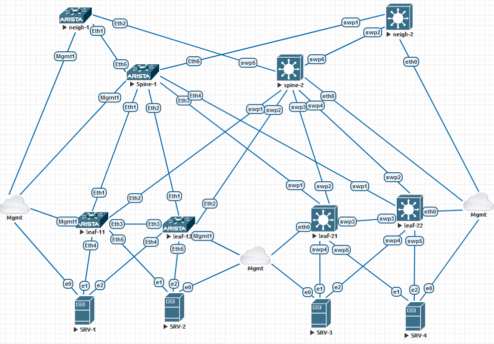

# Лабораторная работа "Оптимизация таблиц маршрутизации"
Цель: отфильтровать маршруты и отдать объединённые маршруты

За основу возьмём предыдущую лабу, добавив в неё два соседних коммутатора. В качестве граничных коммутаторов будем использовать спайны. Не совсем верно архитектурно, но мы не ищем лёгких путей!



## Настроим приём L3VPNа на Border-Spine 

### Arista

Для этого пропишем vrf, для нее, разрешим маршрутизацию, в том числе ipv6, в том числе на интерфейсах, не забудем и про ipv6 unicast-routing. Теперь добавим интерфейсы, через которые будем пирится с новыми соседями, в созданный vrf, и поднимем на них ipv6 пиринг. После чего заведём VxLan интерфейс, где пропишем vni нашего vrf, и нам осталось дописать маршрутизацию.

Слизываем настройку маршрутизации vrf c Leaf, не забыв сменить адрес RD. В этот момент, должен подняться интерфейс VxLan1. 
```
spine-1#sho interfaces vxlan 1
Vxlan1 is up, line protocol is up (connected)
  Hardware is Vxlan
  Source interface is Loopback1 and is active with 172.16.0.1
  Listening on UDP port 4789
  Replication/Flood Mode is headend with Flood List Source: CLI
  Remote MAC learning is disabled
  VNI mapping to VLANs
  Static VLAN to VNI mapping is
  Dynamic VLAN to VNI mapping for 'evpn' is
    [4094, 101000]
  Note: All Dynamic VLANs used by VCS are internal VLANs.
        Use 'show vxlan vni' for details.
  Static VRF to VNI mapping is
   [corporate, 101000]
  Shared Router MAC is 0000.0000.0000
```
После чего дописываем маршрутизацию с соседом, добавив router-id и соседей в настройку vrf. Для новой пир-группы дублируем настройки в address-family ipv4, чтобы начали ходить маршруты.
В результате получим:
```
vrf instance corporate
!
vrf instance mgmt
!
interface Ethernet1
   no switchport
   ipv6 enable
!
interface Ethernet2
   no switchport
   ipv6 enable
!
interface Ethernet3
   no switchport
   ipv6 enable
!
interface Ethernet4
   no switchport
   ipv6 enable
!
interface Ethernet5
   no switchport
   vrf corporate
   ipv6 enable
!
interface Ethernet6
   no switchport
   vrf corporate
   ipv6 enable
!
interface Loopback1
   ip address 172.16.0.1/32
!
interface Management1
   vrf mgmt
   ip address dhcp
!
interface Vxlan1
   vxlan source-interface Loopback1
   vxlan udp-port 4789
   vxlan vrf corporate vni 101000
!
ip virtual-router mac-address 44:38:39:00:00:11
!
ip routing ipv6 interfaces 
ip routing ipv6 interfaces  vrf corporate
no ip routing vrf mgmt
!
ipv6 unicast-routing
ipv6 unicast-routing vrf corporate
!
ip route vrf mgmt 0.0.0.0/0 172.31.255.254
!
route-map ADVERT_INT permit 10
   match interface Loopback1
!
router bgp 65000
   router-id 172.16.0.1
   neighbor neighbor peer group
   neighbor underlay peer group
   neighbor underlay send-community extended
   redistribute connected route-map ADVERT_INT
   neighbor interface Et1 peer-group underlay remote-as 65001
   neighbor interface Et2 peer-group underlay remote-as 65002
   neighbor interface Et3 peer-group underlay remote-as 65003
   neighbor interface Et4 peer-group underlay remote-as 65004
   !
   address-family evpn
      neighbor underlay activate
   !
   address-family ipv4
      neighbor neighbor activate
      neighbor neighbor next-hop address-family ipv6 originate
      neighbor underlay activate
      neighbor underlay next-hop address-family ipv6 originate
   !
   vrf corporate
      rd 172.16.0.1:1000
      route-target import evpn 1000:1000
      route-target export evpn 1000:1000
      router-id 172.16.0.1
      bgp bestpath as-path multipath-relax
      neighbor interface Et5 peer-group neighbor remote-as 64000
      neighbor interface Et6 peer-group neighbor remote-as 63000
!
```

На соседнем коммутаторе, просто, без изысков, настроим маршрутизацию и, для теста, пропишем адрес 8.8.8.8 на лупбеке. Результат в файле neigh-1_route.cfg

### Cumulus

Как обычно, в файле /etc/network/interfaces создаём VRF corporate, прописываем интерфейс для L3VPN, и добавляем его в бридж. Новые интерфейсы пириринга добавляем в VRF corporate (Это те, что идут к новым соседям). Важно, не забыть добавить параметр "vxlan-local-tunnelip" в настроойки loopback интерфейса.
Что получилось - в файле "spine-2_int_route.cfg"
Приступим к настройке маршрутизации, при помощи утилиты vtysh.
Так же копируем настройки с лифов, заменяя настройки на присущие Spine, для получения маршрутов через L3VPN. В итоге получим:
```
vrf corporate
 vni 101000
exit-vrf
!
interface swp5
 ipv6 nd ra-interval 10
 no ipv6 nd suppress-ra
exit
!
interface swp6
 ipv6 nd ra-interval 10
 no ipv6 nd suppress-ra
exit
!
interface swp1
 ipv6 nd ra-interval 10
 no ipv6 nd suppress-ra
exit
!
interface swp2
 ipv6 nd ra-interval 10
 no ipv6 nd suppress-ra
exit
!
interface swp3
 ipv6 nd ra-interval 10
 no ipv6 nd suppress-ra
exit
!
interface swp4
 ipv6 nd ra-interval 10
 no ipv6 nd suppress-ra
exit
!
router bgp 65000
 bgp router-id 172.16.0.2
 neighbor underlay peer-group
 neighbor underlay remote-as external
 neighbor swp1 interface peer-group underlay
 neighbor swp2 interface peer-group underlay
 neighbor swp3 interface peer-group underlay
 neighbor swp4 interface peer-group underlay
 !
 address-family ipv4 unicast
  redistribute connected route-map ADVERTS
  neighbor underlay allowas-in origin
 exit-address-family
 !
 address-family l2vpn evpn
  neighbor underlay activate
  advertise-all-vni
 exit-address-family
exit
!
router bgp 65000 vrf corporate
 bgp router-id 172.16.0.2
 neighbor neig peer-group
 neighbor neig remote-as external
 neighbor swp5 interface peer-group neig
 neighbor swp6 interface peer-group neig
 !
 address-family ipv4 unicast
  redistribute connected route-map VRF_ADVERTS
 exit-address-family
 !
 address-family l2vpn evpn
  advertise ipv4 unicast
  rd 172.16.0.2:1000
  route-target import 1000:1000
  route-target export 1000:1000
 exit-address-family
exit
!
route-map VRF_ADVERTS permit 10
 match interface corporate
exit
!
route-map ADVERTS permit 10
 match interface lo
exit
```

Настройки соседа, также без изысков, кроме того, что мы отдаём через него маршрут по умолчанию.
Результаты в файлах "neig-2_int_route.cfg" и "neig-2_frr_route.cfg".

### Проверка работы

Проверим, что маршруты доходят до соседей
```
neigh-1#sho ip route

VRF: default
Codes: C - connected, S - static, K - kernel,
       O - OSPF, IA - OSPF inter area, E1 - OSPF external type 1,
       E2 - OSPF external type 2, N1 - OSPF NSSA external type 1,
       N2 - OSPF NSSA external type2, B - Other BGP Routes,
       B I - iBGP, B E - eBGP, R - RIP, I L1 - IS-IS level 1,
       I L2 - IS-IS level 2, O3 - OSPFv3, A B - BGP Aggregate,
       A O - OSPF Summary, NG - Nexthop Group Static Route,
       V - VXLAN Control Service, M - Martian,
       DH - DHCP client installed default route,
       DP - Dynamic Policy Route, L - VRF Leaked,
       G  - gRIBI, RC - Route Cache Route

Gateway of last resort:
 B E      0.0.0.0/0 [200/0]
           via fe80::5201:ff:fe02:5, Ethernet2

 C        8.8.8.8/32 [0/0]
           via Loopback2, directly connected
 C        172.16.40.1/32 [0/0]
           via Loopback1, directly connected
 B E      172.20.10.0/24 [200/0]
           via fe80::5201:ff:fee5:e36a, Ethernet1
 B E      172.20.11.0/24 [200/0]
           via fe80::5201:ff:fee5:e36a, Ethernet1
 B E      172.20.14.0/24 [200/0]
           via fe80::5201:ff:fe02:5, Ethernet2

```
Маршруты прилетают. 

## Фильтрация маршрутов

Для целей тестирования будем анонсировать маршрут 172.100.10.0/23 со Spine. Например, это может быть объединённый маршрут до сетей в данной фабрике.
Также не включим в фильтр сеть на vlan14, чтоб посмотреть работу фильтра.

### Arista

Пропишем ip prefix-list, который затем применяется на роут-мапе, который в свою очередь вешается на настройки соседа в маршрутизации, с указанием направления фильтрации.

В качестве аргумента укажем обобщённые маршрут до сетей vlan 10 и 11 с делением до маски /24. Вторым, пропишем тестовый маршрут

Для анонса второго, тестового маршрута, необходимо добавить в анонсы статическую маршрутизацию. Саму статическую маршрутизацию, пропишем в VRF corporate. Добавляем анонсы в настройки VRF процесса BGP. 
Итог в файле: spine-1_route.cfg

### Cumulus

В данном случае, команды настройки фильтрации, совершенно одинаковые для обоих вендоров, за исключением того, что роут-мап на Aricte "вешается" на основной процесс BGP, что не логично (Почему бы тогда и соседство не прописывать тут же, ведь интерфейсы уже в VRF?). У Cumulus это, логично, делается в настройках VRF.

На Cumulus, это будет выглядеть:
```
vrf corporate
 vni 101000
 ip route 172.100.10.0/23 Null0
exit-vrf
!
...
router bgp 65000 vrf corporate
 bgp router-id 172.16.0.2
 neighbor neig peer-group
 neighbor neig remote-as external
 neighbor swp5 interface peer-group neig
 neighbor swp6 interface peer-group neig
 !
 address-family ipv4 unicast
  redistribute connected route-map VRF_ADVERTS
  redistribute static
  neighbor neig route-map NEIG_ADVERT out
 exit-address-family
 !
 address-family l2vpn evpn
  advertise ipv4 unicast
  rd 172.16.0.2:1000
  route-target import 1000:1000
  route-target export 1000:1000
 exit-address-family
exit
!
ip prefix-list NET_ADVERT seq 10 permit 172.20.8.0/22 le 24
ip prefix-list NET_ADVERT seq 20 permit 172.100.10.0/23
!
route-map VRF_ADVERTS permit 10
 match interface corporate
exit
!
route-map ADVERTS permit 10
 match interface lo
exit
!
route-map NEIG_ADVERT permit 10
 match ip address prefix-list NET_ADVERT
exit
```

### Проверка работы

Проверим, что маршруты долетают до соседей

```
neigh-1#sho ip bgp
BGP routing table information for VRF default
Router identifier 172.16.40.1, local AS number 64000
Route status codes: s - suppressed contributor, * - valid, > - active, E - ECMP head, e - ECMP
                    S - Stale, c - Contributing to ECMP, b - backup, L - labeled-unicast
                    % - Pending BGP convergence
Origin codes: i - IGP, e - EGP, ? - incomplete
RPKI Origin Validation codes: V - valid, I - invalid, U - unknown
AS Path Attributes: Or-ID - Originator ID, C-LST - Cluster List, LL Nexthop - Link Local Nexthop

          Network                Next Hop              Metric  AIGP       LocPref Weight  Path
 * >      8.8.8.8/32             -                     -       -          -       0       i
 * >      172.20.10.0/24         fe80::5201:ff:fee5:e36a%Et1 0       -          100     0       65000 65002 i
 *        172.20.10.0/24         fe80::5201:ff:fe02:5%Et2 0       -          100     0       65000 65002 i
 * >      172.20.11.0/24         fe80::5201:ff:fee5:e36a%Et1 0       -          100     0       65000 65002 i
 *        172.20.11.0/24         fe80::5201:ff:fe02:5%Et2 0       -          100     0       65000 65002 i
 * >      172.100.10.0/23        fe80::5201:ff:fee5:e36a%Et1 0       -          100     0       65000 ?
 *        172.100.10.0/23        fe80::5201:ff:fe02:5%Et2 0       -          100     0       65000 ?
```
Маршруты приходят. Мы "забыли", на самом деле, специально не включили в фильтр Vlan14, и как видим данный маршрут был отфильтрован. В предыдущем выводе он присутствует.
Теперь проверим прохождения трафика
```
eve@srv1:~$ ping 8.8.8.8
PING 8.8.8.8 (8.8.8.8) 56(84) bytes of data.
64 bytes from 8.8.8.8: icmp_seq=1 ttl=63 time=104 ms
64 bytes from 8.8.8.8: icmp_seq=2 ttl=63 time=22.7 ms
64 bytes from 8.8.8.8: icmp_seq=3 ttl=63 time=37.2 ms
64 bytes from 8.8.8.8: icmp_seq=4 ttl=63 time=27.7 ms
^C
--- 8.8.8.8 ping statistics ---
4 packets transmitted, 4 received, 0% packet loss, time 3005ms
rtt min/avg/max/mdev = 22.702/47.823/103.726/32.691 ms
eve@srv1:~$ ping 8.8.84.4
PING 8.8.84.4 (8.8.84.4) 56(84) bytes of data.
From 172.16.30.1 icmp_seq=1 Destination Net Unreachable
From 172.16.30.1 icmp_seq=2 Destination Net Unreachable
From 172.16.30.1 icmp_seq=3 Destination Net Unreachable
^C
--- 8.8.84.4 ping statistics ---
3 packets transmitted, 0 received, +3 errors, 100% packet loss, time 2002ms
```
Видно, что пинги до соседних коммутаторов доходят. В первом случае, успешно отвечает лупбек, а во втором приходит отбивка от второго соседа, который анонсирует маршрут по умолчанию.
Вывод: мы добились указанных целей.
