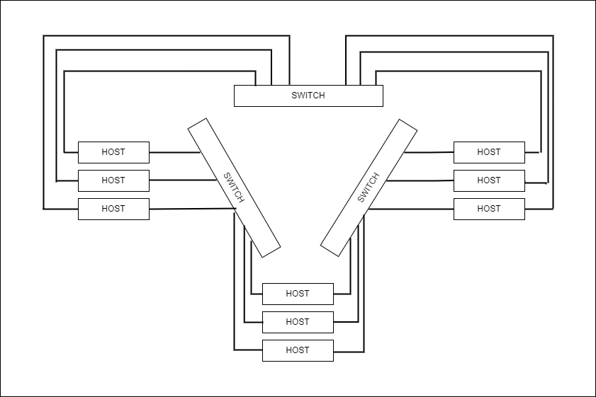
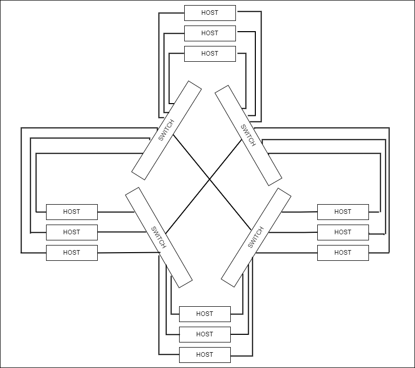
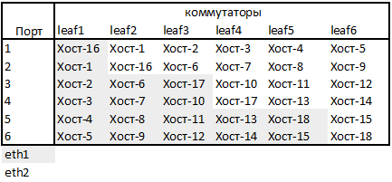
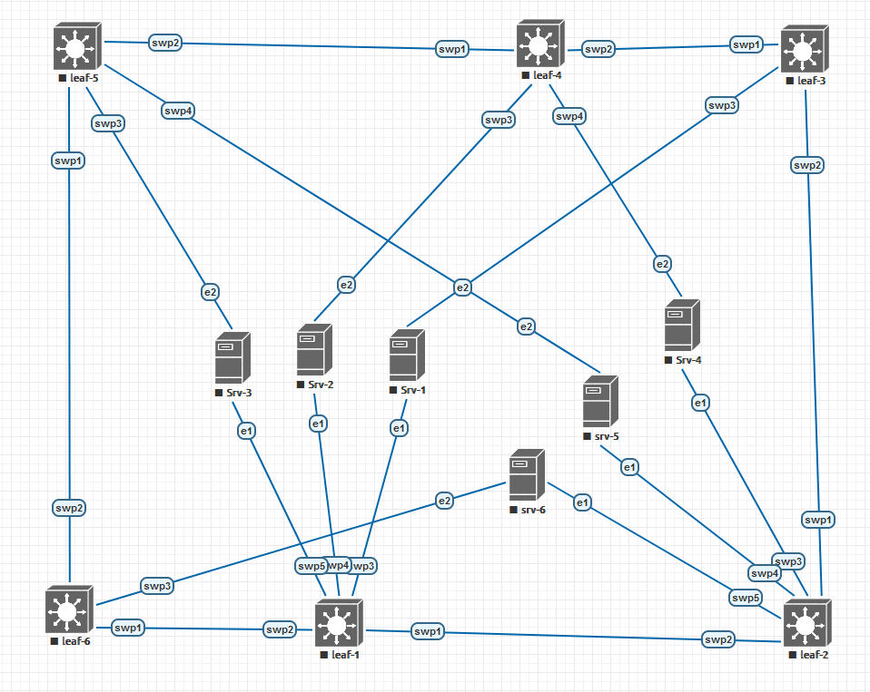

# Проект по теме "Создание L2 фабрики по топологии Dragonfly, с использованием VxLAN и функциями маршрутизации на хостах"

Цель: 
1. разработать топологию, которая будет иметь малые задержки прохождения трафика, максимально использовать пропускную способность всех устройств в сети, иметь максимальное количество портов для подключения серверов.
2. Для нужд автоматизации, на структуре, должно быть минимум уникальных настроек, вообще минимум переменных. Тогда скрипты и плейбуки будут проще.

## Разработка решения
### Выбор топологии

Для построения VxLAN фабрик широко используется топология Leaf-Spine Fat tree, но у ннё есть существенные недостатки в виде высоких задержек, и неоптимальное использование коммутаторов. Данные недостатки решаются применением топологии Dragonfly. В ней нет слоя spine, что уменьшает среднее количество узлов пройденных пакетами, а, следовательно, задержку.

Возьмём за основу следующие постулаты:
1. Все линки в данной работе имеют одинаковую пропускную способность.
2. Пропускная способность узла определяется одним линком. Второй для отказоустойчивости, а не для увелечения скорости.
3. Узел утилизирует 100% пропускной способности, что соответствует 50% пропускной способности линка.
4. Обмен пакетами между всеми узлами равномерный. Трафик сугубо горизонтальный, в направлении восток-запад.
5. Коммутатор используемый в данной работе, не блокируемый, что означает, что он штатно выдерживает 100% загрузки всех его линков.
6. Узел правильно определяет с какого линка доступность требуемого узла выше(меньше переходов до него).

Благодаря этим допущениям, мы уже экономим на портах коммутатора, потому, что даже при использовании, например, трёх коммутаторов, линки для их соединения не требуются. как показано на рисунке



Для схемы с четырьмя  коммутаторами, будет следующей:
На каждый коммутатор схемы будет приходить 50% трафика с каждого узла. Так как у нас 6 узлов подключены в коммутатор, то значит для передачи их полного трафика наверх потребуется всего 3 линка. Но большая часть трафика будет оставаться на самом коммутаторе. Это тот трафик, что предназначен соседям(5 узлов), ещё часть будет передана через другой линк, и никогда не попадёт на данный коммутатор (3 узла). Остаётся только 3 узла, что подсоединены к противоположному коммутатору, то есть 1/4 часть трафика. Иными словами, менее одного линка, вместо трёх.
 
 

Можно поэтапно рассчитывать количество линков для каждой итерации, но у нас есть отличный ограничитель сверху заданный начальными постулатами. А именно: для передачи всего трафика в соседние коммутаторы, достаточно линков количеством в два раза меньшем чем количество подключенных хостов. Так как линки от хостов загружены, максимум на 50%.
 Значит распределение будет следующим, 1/3 линков идёт на соединение с соседними коммутаторами, а 2/3 на подключение хостов.
 Тогда, если взять за основу коммутатор с 64-ю портами, то при полносвязной топологии получится, что в фабрике будет 21 коммутатор, а это количество коммутаторов в фабрике умножить на количество портов для хостов и всё это делённое на два, так как хосту требуется два порта для подключения (21 *(64-21))/2 = 451
 Но такое подключение, даст большую избыточность, так как хост подключен двумя линками, и с каждого у него будет полная связность, с другими узлами. Можно было бы построить два полносвязных кольца, к которым подключены хосты, но и это избыточно, хотя даст увеличение числа узлов в фабрике вдвое.
 Почему бы не поработать с вариантами подключения серверов, так чтобы максимально увеличить число уникальных путей на каждом узле. Например, при традиционном включении, все хосты подключаются к одной паре Leaf, но тогда таблица маршрутов на одном линке хоста, будет аналогична другому. Значит нужно один линк включить в один общий коммутатор, а второй, в тот коммутатор, куда другие хосты, включенные в первый коммутатор, не включены. Получается следующая таблица подключения.





 Лучше построить не полносвязную структуру, в которой вероятность прохождения трёх узлов между хостами была низкой.
 Возьмём количество узлов втрое большее чем аплинков. Первую половину аплинков соединим со следующими коммутаторами, а вторую с предыдущими. Таким образом, получим структуру похожую на топологию кольцо (если аплинков больше двух, при двух аплинках структура вырождается в кольцо), только более связную.

Соберём схему в лабе согласно вышеуказанным принципам. Так как у нас есть ограничение на число работающих машин, то оставим на схеме, только наиболее важные, для объяснения принципа работы схемы, хосты, и только на двух коммутаторах.  Получим:



Так как хосты будут участвовать в построении underlay связности, то увеличение числа хостов, будет только улучшать работу схемы. Покажем, что минимальная схема работоспособна

### Адресация

Мы будем использовать безадресную маршрутизацию, в следствии чего для каждого устройства нашей сети потребуется только один адрес.
Зададим коммутаторам адреса из сети 172.16.1.0/24, а хостам из сети 172.16.2.0/24

## Конфигурация устройств и проверка работы схемы

### Подготовка коммутаторов Cumulus

 Зададим hostname командой ```hostnamectl set-hostname leaf-6 ```, а также поменяем имя в hosts 
 ```
cumulus@cumulus:mgmt:~$ bash
cumulus@leaf-6:mgmt:~$  sudo sed -i "s/cumulus/$HOSTNAME/" /etc/hosts
 ```
Настроим интерфейсы в файле "etc/network/interfaces". Мы настраиваем unnumbered маршрутизацию, поэтому на все интерфейсы пропишем тот же адрес что на Lo интерфейсе.  В итоге, получим:

```
# This file describes the network interfaces available on your system
# and how to activate them. For more information, see interfaces(5).

source /etc/network/interfaces.d/*.intf

# The loopback network interface
auto lo
iface lo inet loopback
    address 172.16.1.6/32

# The primary network interface
auto eth0
iface eth0 inet dhcp
    vrf mgmt

auto mgmt
iface mgmt
    address 127.0.0.1/8
    address ::1/128
    vrf-table auto

auto swp1
iface swp1
    address 172.16.1.6/32

auto swp2
iface swp2
    address 172.16.1.6/32

auto swp3
iface swp3
    address 172.16.1.6/32

auto swp4
iface swp4
    address 172.16.1.6/32

auto swp5
iface swp5
    address 172.16.1.6/32
```


Применим настройки командой ```sudo ifreload -a```. Дальше настроим маршрутизацию.
Включим маршрутизацию ospfv2 поставив "yes" напротив соответствующего демона в файле ```/etc/frr/daemons```

```
...
# The watchfrr daemon is always started. Per default in monitoring-only but
# that can be changed.
#
bgpd=no
ospfd=yes
ospf6d=no
ripd=no
ripngd=no
isisd=no
pimd=no
ldpd=no
nhrpd=no
eigrpd=no
babeld=no
sharpd=no
pbrd=no
fabricd=no
vrrpd=no

#
# If this option is set the /etc/init.d/frr script automatically loads
# the config via "vtysh -b" when the servers are started.
# Check /etc/pam.d/frr if you intend to use "vtysh"!
...
```
Перегружаем сервис FRR, для применения настроек, командой ```sudo systemctl restart frr.service```
Теперь переходим к настройке маршрутизации запустив утилиту vtysh вводим следующие настройки:
```
cumulus@leaf-6:mgmt:~$ sudo vtysh

Hello, this is FRRouting (version 8.4.3).
Copyright 1996-2005 Kunihiro Ishiguro, et al.

leaf-6# sho run
Building configuration...

Current configuration:
!
frr version 8.4.3
frr defaults datacenter
hostname leaf-6
log syslog informational
service integrated-vtysh-config
!
end
leaf-6# conf t
leaf-6(config)# router ospf
leaf-6(config-router)# ospf router-id 172.16.1.6
leaf-6(config-router)# conf t
% Unknown command: conf t
leaf-6(config-router)# passive-interface default
leaf-6(config-router)# exit
leaf-6(config)# interface swp1
exit
!
interface swp2
 ip ospf area 0
 ip ospf mtu-ignore
 ip ospf network point-to-point
 no ip ospf passive
exit
!
interface swp3
 ip ospf area 0
 ip ospf mtu-ignore
 ip ospf network point-to-point
 no ip ospf passive
exit
!
interface swp4
 ip ospf area 0
 ip ospf mtu-ignore
 ip ospf network point-to-point
 no ip ospf passive
exit
!
interface swp5
 ip ospf area 0
 ip ospf mtu-ignore
 ip ospf network point-to-point
 no ip ospf passive
exit
!
leaf-6(config-if)#  ip ospf area 0
leaf-6(config-if)#  ip ospf mtu-ignore
leaf-6(config-if)#  ip ospf network point-to-point
leaf-6(config-if)#  no ip ospf passive
leaf-6(config-if)# exit
leaf-6(config)# !
leaf-6(config)# interface swp2
leaf-6(config-if)#  ip ospf area 0
leaf-6(config-if)#  ip ospf mtu-ignore
leaf-6(config-if)#  ip ospf network point-to-point
leaf-6(config-if)#  no ip ospf passive
leaf-6(config-if)# exit
leaf-6(config)# !
leaf-6(config)# interface swp3
leaf-6(config-if)#  ip ospf area 0
leaf-6(config-if)#  ip ospf mtu-ignore
leaf-6(config-if)#  ip ospf network point-to-point
leaf-6(config-if)#  no ip ospf passive
leaf-6(config-if)# exit
leaf-6(config)# !
leaf-6(config)# interface swp4
leaf-6(config-if)#  ip ospf area 0
leaf-6(config-if)#  ip ospf mtu-ignore
leaf-6(config-if)#  ip ospf network point-to-point
leaf-6(config-if)#  no ip ospf passive
leaf-6(config-if)# exit
leaf-6(config)# !
leaf-6(config)# interface swp5
leaf-6(config-if)#  ip ospf area 0
leaf-6(config-if)#  ip ospf mtu-ignore
leaf-6(config-if)#  ip ospf network point-to-point
leaf-6(config-if)#  no ip ospf passive
leaf-6(config-if)# exit
leaf-6(config)# !
leaf-6(config)# int lo
leaf-6(config-if)#  ip ospf area 0
leaf-6(config-if)# leaf-6#
leaf-6# wr
Note: this version of vtysh never writes vtysh.conf
Building Configuration...
Integrated configuration saved to /etc/frr/frr.conf
[OK]
leaf-6# sho run
Building configuration...

Current configuration:
!
frr version 8.4.3
frr defaults datacenter
hostname leaf-6
log syslog informational
service integrated-vtysh-config
!
interface lo
 ip ospf area 0
exit
!
interface swp1
 ip ospf area 0
 ip ospf mtu-ignore
 ip ospf network point-to-point
 no ip ospf passive
exit
!
interface swp2
 ip ospf area 0
 ip ospf mtu-ignore
 ip ospf network point-to-point
 no ip ospf passive
exit
!
interface swp3
 ip ospf area 0
 ip ospf mtu-ignore
 ip ospf network point-to-point
 no ip ospf passive
exit
!
interface swp4
 ip ospf area 0
 ip ospf mtu-ignore
 ip ospf network point-to-point
 no ip ospf passive
exit
!
interface swp5
 ip ospf area 0
 ip ospf mtu-ignore
 ip ospf network point-to-point
 no ip ospf passive
exit
!
router ospf
 ospf router-id 172.16.1.6
 passive-interface default
exit
!
end
leaf-6#
```
На этом настройка коммутаторов закончена
Проверим, что маршруты получены:
```
cumulus@leaf-6:mgmt:~$ net sho route ospf
RIB entry for ospf
==================
Codes: K - kernel route, C - connected, S - static, R - RIP,
       O - OSPF, I - IS-IS, B - BGP, E - EIGRP, N - NHRP,
       T - Table, A - Babel, D - SHARP, F - PBR, f - OpenFabric,
       Z - FRR,
       > - selected route, * - FIB route, q - queued, r - rejected, b - backup
       t - trapped, o - offload failure

O>* 172.16.1.1/32 [110/100] via 172.16.1.1, swp1 onlink, weight 1, 00:10:30
O>* 172.16.1.2/32 [110/200] via 172.16.1.1, swp1 onlink, weight 1, 00:10:30
O>* 172.16.1.3/32 [110/300] via 172.16.1.1, swp1 onlink, weight 1, 00:10:30
  *                         via 172.16.1.5, swp2 onlink, weight 1, 00:10:30
O>* 172.16.1.4/32 [110/200] via 172.16.1.5, swp2 onlink, weight 1, 00:10:30
O>* 172.16.1.5/32 [110/100] via 172.16.1.5, swp2 onlink, weight 1, 00:10:30
O   172.16.1.6/32 [110/0] is directly connected, lo, weight 1, 00:10:37
```
Все коммутаторы присутствуют

### Настройка серверов

Сервера у нас будут работать под управлением OS Ubuntu 22.04 LTS.
Так же как у коммутаторов, зададим имя устройству.
```
eve@ubuntu22-server:~$ sudo hostnamectl hostname srv-6
eve@ubuntu22-server:~$ bash
eve@srv-6:~$ sudo sed -i "s/ubuntu22-server/$HOSTNAME/" /etc/hosts
eve@srv-6:~$ cat /etc/hosts
127.0.0.1 localhost
127.0.1.1 srv-6

# The following lines are desirable for IPv6 capable hosts
::1     ip6-localhost ip6-loopback
fe00::0 ip6-localnet
ff00::0 ip6-mcastprefix
ff02::1 ip6-allnodes
ff02::2 ip6-allrouters
```

Настройку интерфейсов осуществим, изменением файла "/etc/netplan", где так же как на коммутаторах, пропишем одинаковые адреса на интерфейсах, участвующих в маршрутизации OSPF. Также создадим бридж, пропишем на него адрес, для проверки связности (в принципе, если на хосте есть виртуальные машины, то собственный адрес - не обязателен), который будет доступен по сети средствами L2VPN. Для этого, пропишем настройки туннеля:

```
# This is the network config written by 'subiquity'
network:
  version: 2
  ethernets:
    lo:
      addresses: [172.16.2.6/32]
    ens3:
      dhcp4: true
      mtu: 1500
    ens4:
      addresses: [172.16.2.6/32]
      dhcp4: false
      mtu: 9216
    ens5:
      addresses: [172.16.2.6/32]
      dhcp4: false
      mtu: 9216
  bridges:
    br1:
      macaddress: 44:38:39:ff:06:01
      addresses:
        - 172.20.40.6/24
      interfaces:
        - vxlan1000
  tunnels:
    vxlan1000:
      mode: vxlan
      id: 101000
      link: lo
      port: 4789
      local: 172.16.2.6
```

Применяем настройки командой ```sudo netplan apply ```. 
Включим маршрутизацию на сервере активировав опцию "net.ipv4.ip_forward=1" в файле ```/etc/sysctl.conf``` и приступим к настройке маршрутизации. Для этого необходимо установить пакет FRR ```sudo apt update && sudo apt install frr```. После чего в файле "/etc/frr/daemons" нужно не только включить OSPFv2 и BGP, но и активировать профиль "Data-Center":

```
...
# The watchfrr, zebra and staticd daemons are always started.
#
bgpd=yes
ospfd=yes
ospf6d=no
ripd=no
ripngd=no
isisd=no
pimd=no
ldpd=no
nhrpd=no
eigrpd=no
babeld=no
sharpd=no
pbrd=no
bfdd=no
fabricd=no
vrrpd=no
pathd=no

#
# If this option is set the /etc/init.d/frr script automatically loads
...
...
# configuration profile
#
#frr_profile="traditional"
frr_profile="datacenter"

#
...
```

После чего хост желательно перезагрузить.
Настройка маршрутизации также как на коммутаторах, производится утилитой  vtysh. В итоге получим:

```
srv-6# sho run
Building configuration...

Current configuration:
!
frr version 8.1
frr defaults datacenter
hostname srv-6
log syslog informational
no ipv6 forwarding
service integrated-vtysh-config
!
interface lo
 ip address 172.16.2.6/32
 ip ospf area 0
exit
!
interface ens3
 ip ospf passive
exit
!
interface ens4
 ip ospf area 0
 ip ospf mtu-ignore
 ip ospf network point-to-point
 no ip ospf passive
exit
!
interface ens5
 ip ospf area 0
 ip ospf mtu-ignore
 ip ospf network point-to-point
 no ip ospf passive
exit
!
router bgp 65000
 bgp router-id 172.16.2.6
 neighbor 172.16.2.1 remote-as internal
 neighbor 172.16.2.2 remote-as internal
 neighbor 172.16.2.3 remote-as internal
 neighbor 172.16.2.4 remote-as internal
 neighbor 172.16.2.5 remote-as internal
 !
 address-family l2vpn evpn
  neighbor 172.16.2.1 activate
  neighbor 172.16.2.2 activate
  neighbor 172.16.2.3 activate
  neighbor 172.16.2.4 activate
  neighbor 172.16.2.5 activate
  advertise-all-vni
  vni 101000
   advertise-svi-ip
  exit-vni
 exit-address-family
exit
!
router ospf
 ospf router-id 172.16.2.6
 passive-interface default
exit
!
end
```

Возможно у вас появится пункт "no ip forwarding", что говорит о том, что трафик через узел идти не будет. Этот пункт нужно убрать введя команду "ip forwarding".
* Без пункта "advertise-svi-ip" всё будет работать, но не будут кэшироваться пути, из-за чего мы не увидим маршруты типа 2 (mac-ip). 

Получим:

```
srv-6# sho bgp l2vpn evpn
BGP table version is 3, local router ID is 172.16.2.6
Status codes: s suppressed, d damped, h history, * valid, > best, i - internal
Origin codes: i - IGP, e - EGP, ? - incomplete
EVPN type-1 prefix: [1]:[EthTag]:[ESI]:[IPlen]:[VTEP-IP]
EVPN type-2 prefix: [2]:[EthTag]:[MAClen]:[MAC]:[IPlen]:[IP]
EVPN type-3 prefix: [3]:[EthTag]:[IPlen]:[OrigIP]
EVPN type-4 prefix: [4]:[ESI]:[IPlen]:[OrigIP]
EVPN type-5 prefix: [5]:[EthTag]:[IPlen]:[IP]

   Network          Next Hop            Metric LocPrf Weight Path
Route Distinguisher: 172.16.2.1:2
*>i[2]:[0]:[48]:[44:38:39:ff:01:01]:[32]:[172.20.40.1]
                    172.16.2.1(srv-1)
                                                  100      0 i
                    RT:65000:101000 ET:8
*>i[2]:[0]:[48]:[44:38:39:ff:01:01]:[128]:[fe80::4638:39ff:feff:101]
                    172.16.2.1(srv-1)
                                                  100      0 i
                    RT:65000:101000 ET:8
*>i[3]:[0]:[32]:[172.16.2.1]
                    172.16.2.1(srv-1)
                                                  100      0 i
                    RT:65000:101000 ET:8
Route Distinguisher: 172.16.2.2:2
*>i[2]:[0]:[48]:[44:38:39:ff:02:01]:[32]:[172.20.40.2]
                    172.16.2.2(srv-2)
                                                  100      0 i
                    RT:65000:101000 ET:8
*>i[2]:[0]:[48]:[44:38:39:ff:02:01]:[128]:[fe80::4638:39ff:feff:201]
                    172.16.2.2(srv-2)
                                                  100      0 i
                    RT:65000:101000 ET:8
*>i[3]:[0]:[32]:[172.16.2.2]
                    172.16.2.2(srv-2)
                                                  100      0 i
                    RT:65000:101000 ET:8
Route Distinguisher: 172.16.2.3:2
*>i[2]:[0]:[48]:[44:38:39:ff:03:01]:[32]:[172.20.40.3]
                    172.16.2.3(srv-3)
                                                  100      0 i
                    RT:65000:101000 ET:8
*>i[2]:[0]:[48]:[44:38:39:ff:03:01]:[128]:[fe80::4638:39ff:feff:301]
                    172.16.2.3(srv-3)
                                                  100      0 i
                    RT:65000:101000 ET:8
*>i[3]:[0]:[32]:[172.16.2.3]
                    172.16.2.3(srv-3)
                                                  100      0 i
                    RT:65000:101000 ET:8
Route Distinguisher: 172.16.2.4:2
*>i[2]:[0]:[48]:[44:38:39:ff:04:01]:[32]:[172.20.40.4]
                    172.16.2.4(srv-4)
                                                  100      0 i
                    RT:65000:101000 ET:8
*>i[2]:[0]:[48]:[44:38:39:ff:04:01]:[128]:[fe80::4638:39ff:feff:401]
                    172.16.2.4(srv-4)
                                                  100      0 i
                    RT:65000:101000 ET:8
*>i[3]:[0]:[32]:[172.16.2.4]
                    172.16.2.4(srv-4)
                                                  100      0 i
                    RT:65000:101000 ET:8
Route Distinguisher: 172.16.2.5:2
*>i[2]:[0]:[48]:[44:38:39:ff:05:01]:[32]:[172.20.40.5]
                    172.16.2.5(srv-5)
                                                  100      0 i
                    RT:65000:101000 ET:8
*>i[2]:[0]:[48]:[44:38:39:ff:05:01]:[128]:[fe80::4638:39ff:feff:501]
                    172.16.2.5(srv-5)
                                                  100      0 i
                    RT:65000:101000 ET:8
*>i[3]:[0]:[32]:[172.16.2.5]
                    172.16.2.5(srv-5)
                                                  100      0 i
                    RT:65000:101000 ET:8
Route Distinguisher: 172.16.2.6:2
*> [2]:[0]:[48]:[44:38:39:ff:06:01]:[32]:[172.20.40.6]
                    172.16.2.6(srv-6)
                                                       32768 i
                    ET:8 RT:65000:101000
*> [2]:[0]:[48]:[44:38:39:ff:06:01]:[128]:[fe80::4638:39ff:feff:601]
                    172.16.2.6(srv-6)
                                                       32768 i
                    ET:8 RT:65000:101000
*> [3]:[0]:[32]:[172.16.2.6]
                    172.16.2.6(srv-6)
                                                       32768 i
                    ET:8 RT:65000:101000

Displayed 18 out of 18 total prefixes
```

### Проверка работы

Как видно, из вышеописанного, маршруты до хостов благополучно прилетают. Проверим, точно ли работают маршруты через хосты. Возмём два масимально далёких друг от друга хоста: Srv-2 и Srv-6. Они включены в разные коммутаторы, и маршрут до них пролегает через два скачка минимум. Выключим коммутатор leaf-6 и выключим линки соединяющие leaf2 с соседними коммутаторами.
Выключив коммутатор Leaf-6 мы некоторое время не видим связности между узлами Srv-2 и Srv-6, но спустя десятка секунд, связь восстановилась. После отключения линков на leaf-2 и вовсе не было перерыва. То есть сеть уже стала использовать маршруты через конечных пользователей.

```
eve@srv-2:~$ ping 172.20.40.6
PING 172.20.40.6 (172.20.40.6) 56(84) bytes of data.
64 bytes from 172.20.40.6: icmp_seq=1 ttl=64 time=10.9 ms
64 bytes from 172.20.40.6: icmp_seq=2 ttl=64 time=1.54 ms
64 bytes from 172.20.40.6: icmp_seq=3 ttl=64 time=1.58 ms
64 bytes from 172.20.40.6: icmp_seq=4 ttl=64 time=1.37 ms
64 bytes from 172.20.40.6: icmp_seq=5 ttl=64 time=1.54 ms
64 bytes from 172.20.40.6: icmp_seq=6 ttl=64 time=1.40 ms
64 bytes from 172.20.40.6: icmp_seq=7 ttl=64 time=1.32 ms
64 bytes from 172.20.40.6: icmp_seq=8 ttl=64 time=1.95 ms
From 172.20.40.2 icmp_seq=15 Destination Host Unreachable
From 172.20.40.2 icmp_seq=16 Destination Host Unreachable
From 172.20.40.2 icmp_seq=17 Destination Host Unreachable
From 172.20.40.2 icmp_seq=18 Destination Host Unreachable
From 172.20.40.2 icmp_seq=19 Destination Host Unreachable
From 172.20.40.2 icmp_seq=20 Destination Host Unreachable
From 172.20.40.2 icmp_seq=21 Destination Host Unreachable
From 172.20.40.2 icmp_seq=22 Destination Host Unreachable
From 172.20.40.2 icmp_seq=23 Destination Host Unreachable
From 172.20.40.2 icmp_seq=24 Destination Host Unreachable
From 172.20.40.2 icmp_seq=25 Destination Host Unreachable
From 172.20.40.2 icmp_seq=26 Destination Host Unreachable
From 172.20.40.2 icmp_seq=27 Destination Host Unreachable
From 172.20.40.2 icmp_seq=28 Destination Host Unreachable
From 172.20.40.2 icmp_seq=29 Destination Host Unreachable
From 172.20.40.2 icmp_seq=30 Destination Host Unreachable
From 172.20.40.2 icmp_seq=31 Destination Host Unreachable
From 172.20.40.2 icmp_seq=32 Destination Host Unreachable
From 172.20.40.2 icmp_seq=33 Destination Host Unreachable
From 172.20.40.2 icmp_seq=34 Destination Host Unreachable
From 172.20.40.2 icmp_seq=35 Destination Host Unreachable
From 172.20.40.2 icmp_seq=36 Destination Host Unreachable
From 172.20.40.2 icmp_seq=37 Destination Host Unreachable
From 172.20.40.2 icmp_seq=38 Destination Host Unreachable
From 172.20.40.2 icmp_seq=39 Destination Host Unreachable
From 172.20.40.2 icmp_seq=40 Destination Host Unreachable
From 172.20.40.2 icmp_seq=41 Destination Host Unreachable
64 bytes from 172.20.40.6: icmp_seq=42 ttl=64 time=1594 ms
64 bytes from 172.20.40.6: icmp_seq=43 ttl=64 time=570 ms
64 bytes from 172.20.40.6: icmp_seq=44 ttl=64 time=1.32 ms
64 bytes from 172.20.40.6: icmp_seq=45 ttl=64 time=0.963 ms
```

Сервер SRV-6 остался подключен только одним линком к leaf-2, и так как на leaf-2 данные могут приходить только через другие серверы Srv-4 и Srv-5, то получается, что они являются промежуточными узлами для Srv-6.

## Ограничения

В схеме можно использовать только один бридж с IP адресом, это связано стем, что опция "net.ipv4.ip_forward=1" включает, в том числе, маршрутизацию между бриджами.
К сожалению, у меня не получилось настроить VRF, чтобы запустить полноценный L3VPN. Вероятно, из-за ограничений NETPLAN.  VRF, вообще, криво реализован на Linux. Там есть проблемы  с DNS, многие сервисы не могут запускаться под VRF.
Ещё одним ограничением является то, что OSPF не учитывает нагрузку на линк или, хотя бы заполненность очередей на интерфейсах. Что плохо влияет на балансировку нагрузки по независимым путям.

## Вывод
Мы получили структуру с низкими задержками, с минимальными настройками и способную увеличивать свою производительность при увеличении количества узлов. Но требуется опитмизация работы протокола маршрутизации, для более устойчивой работы в случае отказов. 
Также, как и всем топологиям Dragonfly, нашей структуре, не мешало бы, в протоколе маршрутизации, учитывать заполненость буферов, при нахождении оптимальных/кратчайших маршрутов. Так как FRR является открытым продуктом, с открытым кодом написанным  на Python, есть надежда на реализацию данного функционала. 


